# P&C 채용관리 — 기능 명세서

## 문서의 목적과 범위

이 문서는 현재 리포지토리에 구현되어 있는 **프론트엔드 인메모리 프로토타입**(`src/`)의 동작을 코드 기준으로 정리한 기능 명세서입니다. 이 시스템을 실제 백엔드가 있는 서비스로 처음부터 다시 구현할 팀(테크팀)이 읽는다고 가정하고 작성했으며, 다음을 목표로 합니다.

- 화면 뒤에 숨어 있는 **데이터 구조**(도메인 모델)를 명확히 한다.
- 화면 곳곳에 흩어져 있는 **판정 로직**(예: "이 지원자는 면접 예정인가?")을 한 곳에 모아 문장으로 설명한다.
- 화면별로 "무엇을 할 수 있고, 그 결과 무엇이 바뀌는지"를 빠짐없이 적는다.
- 이 프로토타입의 한계와, 실제로 다시 만들 때 눈여겨봐야 할 지점을 정리한다.

이 문서는 **현재 코드가 실제로 하는 일**을 기준으로 작성되었습니다. `README.md`나 `docs/decision-log.md`에 남아 있는 설명 중 현재 코드와 다른 부분이 있다면, 이 문서는 코드 쪽을 따랐고 그 차이는 대화로 별도 보고했습니다.

---

## 1. 도메인 모델

이 시스템에는 정식 데이터베이스가 없습니다. 모든 데이터는 브라우저 메모리(React Context의 `useState`)에 있고, 새로고침하면 `src/data/dummyJobPostings.ts` · `src/data/dummyApplicants.ts`의 초기값으로 되돌아갑니다. 아래 모델은 "실제로 저장된 형태"가 아니라 "코드가 다루는 타입 구조"를 정리한 것입니다.

### 1.1 전체 구조 개요

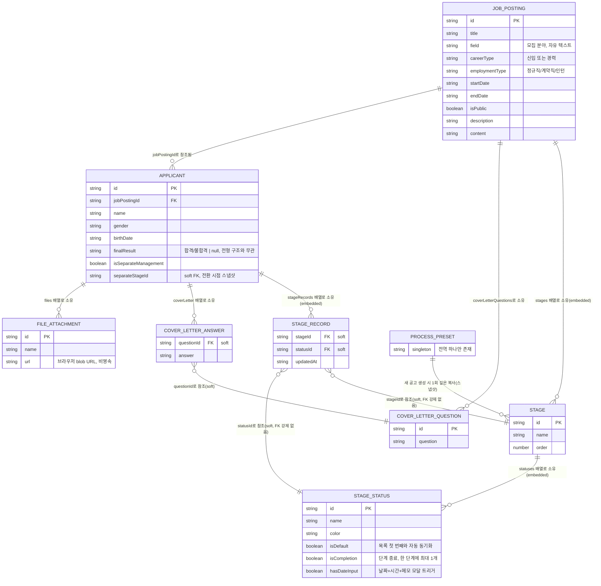
```mermaid
erDiagram
    JOB_POSTING ||--o{ STAGE : "stages 배열로 소유(embedded)"
    STAGE ||--o{ STAGE_STATUS : "statuses 배열로 소유(embedded)"
    JOB_POSTING ||--o{ COVER_LETTER_QUESTION : "coverLetterQuestions로 소유"
    JOB_POSTING ||--o{ APPLICANT : "jobPostingId로 참조됨"
    APPLICANT ||--o{ STAGE_RECORD : "stageRecords 배열로 소유(embedded)"
    APPLICANT ||--o{ COVER_LETTER_ANSWER : "coverLetter 배열로 소유"
    APPLICANT ||--o{ FILE_ATTACHMENT : "files 배열로 소유"
    STAGE_RECORD }o--|| STAGE : "stageId로 참조(soft, FK 강제 없음)"
    STAGE_RECORD }o--|| STAGE_STATUS : "statusId로 참조(soft, FK 강제 없음)"
    COVER_LETTER_ANSWER }o--|| COVER_LETTER_QUESTION : "questionId로 참조(soft)"
    PROCESS_PRESET ||--o{ STAGE : "새 공고 생성 시 1회 깊은 복사(스냅샷)"

    JOB_POSTING {
        string id PK
        string title
        string field "모집 분야, 자유 텍스트"
        string careerType "신입 또는 경력"
        string employmentType "정규직/계약직/인턴"
        string startDate
        string endDate
        boolean isPublic
        string description
        string content
    }
    STAGE {
        string id PK
        string name
        number order
    }
    STAGE_STATUS {
        string id PK
        string name
        string color
        boolean isDefault "목록 첫 번째와 자동 동기화"
        boolean isCompletion "단계 종료, 한 단계에 최대 1개"
        boolean hasDateInput "날짜+시간+메모 모달 트리거"
    }
    APPLICANT {
        string id PK
        string jobPostingId FK
        string name
        string gender
        string birthDate
        string finalResult "합격/불합격 | null, 전형 구조와 무관"
        boolean isSeparateManagement
        string separateStageId "soft FK, 전환 시점 스냅샷"
    }
    STAGE_RECORD {
        string stageId FK "soft"
        string statusId FK "soft"
        string updatedAt
    }
    COVER_LETTER_QUESTION {
        string id PK
        string question
    }
    COVER_LETTER_ANSWER {
        string questionId FK "soft"
        string answer
    }
    FILE_ATTACHMENT {
        string id PK
        string name
        string url "브라우저 blob URL, 비영속"
    }
    PROCESS_PRESET {
        string singleton "전역 하나만 존재"
    }
```

**"soft" 참조에 대한 주의**: 위 다이어그램에서 `soft`라고 표시한 관계는 데이터베이스 외래키(FK)가 아니라, 문자열 id를 그대로 저장해두고 조회할 때마다 배열에서 `find`로 찾는 방식입니다. 참조 대상(예: 상태값, 자소서 문항)이 삭제되어도 참조하는 쪽의 레코드는 그대로 남고, 조회 로직이 "폴백" 또는 "삭제된 항목" 표시로 방어합니다. 이 폴백 규칙은 [2.10](#210-기록-없는-단계-삭제된-상태-참조-시-폴백-규칙)에서 다룹니다.

### 1.2 JobPosting (채용 공고)

| 필드 | 타입 | 필수 | 의미 / 제약 |
|---|---|---|---|
| `id` | string (uuid) | 필수 | PK |
| `title` | string | 필수 | 공고 제목 |
| `field` | string | 필수(자유 텍스트) | **모집 분야**. 예전에는 `department`(부서)/`position`(포지션, 선택) 두 필드였는데, 등록 폼에는 department 입력만 있고 지원자 필터/카드는 (당시 `Applicant.team`이라는 별도 필드를) 참조하는 불일치가 있었다. 조직 구조가 유동적이라 구조화된 값 목록보다 자유 텍스트가 맞고, 하나로 합쳐 두면 향후 외부 시스템(인트라넷 등) 연동 시 이 필드에 값을 매핑하면 된다(2026-07-21 decision-log). 등록/수정 폼은 자동완성 인풋(`FieldAutocomplete`)으로, 기존에 입력된 값 중 매칭되는 것만 추천하고 새 값도 항상 입력 가능하다 — 별도로 관리되는 마스터 목록은 없음 |
| `careerType` | `'신입' \| '경력'` | 필수 | |
| `employmentType` | `'정규직' \| '계약직' \| '인턴'` | 필수 | |
| `startDate` / `endDate` | string (`YYYY-MM-DD`) | 필수 | `endDate`는 공고 상태 자동 판정([2.1](#21-공고-상태진행중종료-자동-판정-규칙))과 목록/대시보드의 기본 정렬(마감일 임박순) 기준으로 쓰임 |
| `isPublic` | boolean | 필수 | 공개 여부. 다만 이 프로토타입에는 지원자가 실제로 보는 "외부 공개 페이지"가 없어서, 이 값은 관리 화면의 토글 상태 그 이상의 효과는 없음 |
| `description` | string | 필수(빈 문자열 허용) | 목록에 노출되는 한 줄 요약 |
| `content` | string | 필수(빈 문자열 허용) | 공고 본문 |
| `coverLetterQuestions` | `CoverLetterQuestion[]` | 필수(빈 배열 허용) | 자기소개서 문항. 공고가 소유 |
| `stages` | `Stage[]` | 필수 | 전형 단계. **공고가 직접 소유**하며 다른 공고와 절대 공유되지 않음. 새 공고 생성 시 "기본 프로세스 프리셋"을 깊은 복사한 독립 사본으로 시작([2.2](#22-전형-단계상태의-소유-구조와-프리셋-복사-규칙)) |
| `createdBy` / `updatedBy` | string | 필수 | 현재는 항상 고정 문자열 `"admin"` — 실제 로그인/담당자 구분 없음 |
| `createdAt` / `updatedAt` | string (ISO datetime) | 필수 | |

**공고에는 "상태" 필드가 저장되어 있지 않습니다.** 진행중/종료는 항상 `endDate`와 현재 시각으로부터 매번 계산되는 파생값입니다([2.1](#21-공고-상태진행중종료-자동-판정-규칙)).

### 1.3 Stage (전형 단계)

`JobPosting.stages` 배열의 원소이며, 공고 하나가 여러 단계를 순서대로 갖습니다.

| 필드 | 타입 | 필수 | 의미 / 제약 |
|---|---|---|---|
| `id` | string (uuid) | 필수 | PK |
| `name` | string | 필수 | 단계 이름 (예: "인성검사 안내") |
| `order` | number | 필수 | 1부터 시작하는 순번. 화면의 도트 드래그 핸들로만 바꿀 수 있고(직접 숫자 입력 UI 없음), 단계를 추가/삭제/이동할 때마다 전체 배열이 1..N으로 재계산됨 |
| `statuses` | `StageStatus[]` | 필수(최소 1개) | 이 단계 안에서 지원자가 가질 수 있는 상태값 목록. 날짜 입력 트리거는 이제 단계가 아니라 각 상태의 `hasDateInput`에 있음([2.4](#24-날짜입력hasdateinput과-모달-트리거-조건)) |
| `autoSend` | `AutoSendConfig` | 선택 | 이 단계의 안내 메시지 설정 — 자동·수동 발송이 공용으로 쓰는 템플릿(채널/제목/본문)과 "자동 발송 사용" 여부. **실제 발송 기능은 없고 발송 기록(`StageRecord.meta.send`)만 남김**([2.15](#215-발송-메시지안내-발송-정책--템플릿은-단계-소유-발송은-지원자-단위-프로토타입은-기록만)) |

단계에는 "합불 판정 단계"와 "일반 단계" 같은 구분이 없습니다. 담당자가 원하면 "합격"/"불합격"이라는 이름의 상태값을 이름과 색만 가진 일반 상태로 직접 만들 수도 있지만(집계에는 전혀 쓰이지 않음 — 최종 합불은 오직 `Applicant.finalResult`로만 판단합니다, [2.11](#211-최종-결과finalresult와-전형-구조의-분리)), **기본 프로세스 프리셋에는 그런 이름의 상태값이 아예 없습니다** — 07-15에 단계별 합불 판정 개념을 폐지한 뒤에도 프리셋에는 "이름과 색만 있는 합격/불합격"이 남아 있었는데, 실제로 써보니 이마저 군더더기라 07-16에 프리셋에서 완전히 들어냈습니다(2026-07-16 decision-log). 단계 통과는 "다음 단계로의 이동"으로, 탈락은 `finalResult`로 표현하면 충분합니다.

### 1.4 StageStatus (전형 상태값)

`Stage.statuses` 배열의 원소입니다.

| 필드 | 타입 | 필수 | 의미 / 제약 |
|---|---|---|---|
| `id` | string (uuid) | 필수 | PK |
| `name` | string | 필수 | 상태 이름 (예: "대기", "필요", "완료", "합격") |
| `color` | string | 필수 | 10종 고정 팔레트(`STAGE_COLOR_PALETTE`) 중 하나의 id. 배지 배경색으로 쓰이고, 글자색은 WCAG 명도 대비 계산으로 흰/검 중 자동 선택됨(`getContrastTextColor`) |
| `isDefault` | boolean | 선택 | "시작 상태" 플래그. **직접 지정하는 UI가 없고, `statuses` 배열의 첫 번째 항목과 항상 자동 동기화된다**(`syncStatusFlags`, 상태를 추가/삭제/순서 변경할 때마다 저장 시점에 재계산됨). 상태 관리 모달은 맨 위 항목에 "시작" 배지만 보여줄 뿐 별도로 지정하게 하지 않는다 |
| `isCompletion` | boolean | 선택 | "이 상태가 되면 단계가 종료된 것으로 집계"(UI 라벨: "종료"). **`isDefault`와 완전히 대칭인 위치 기반 플래그다** — `statuses` 배열의 **마지막** 항목과 항상 자동 동기화되며(`syncStatusFlags`), 체크박스 등 직접 켜고 끄는 UI가 없다. 상태 순서를 드래그로 바꾸면 맨 아래로 온 상태가 곧 종료 상태가 된다(2026-07-17 결정, 2.12) |
| `hasDateInput` | boolean | 선택 | 이 상태로 바꿀 때 날짜(기간)+시간(선택)+메모 입력 모달을 띄울지 여부([2.4](#24-날짜입력hasdateinput과-모달-트리거-조건)). 기본 프리셋과 새 단계의 기본 상태 세트는 **모든 상태가 이 값을 가진다**(2026-07-20 — 어느 상태로 바뀌든 기록을 남길 수 있는 것이 기본값이고, 불필요하면 끄는 쪽이 담당자의 선택) |

이름이 "합격"/"불합격"인 상태값을 만들어도 위 필드 외에 별도로 갖는 속성은 없습니다 — 그저 이름과 색만 있는 일반 상태입니다. 예전에는 `isPass`/`isFail`라는 별도 플래그와 `Stage.stageType`(`'normal' \| 'result'`) 구분이 있었지만, 프로토타입 검증 과정에서 "단계별 합불 판정"이라는 개념 자체를 폐지하면서 함께 제거했습니다(2026-07-15 decision-log 두 번째 항목). 기본 프리셋에는 애초에 "합격"/"불합격" 이름의 상태값 자체가 없습니다(2026-07-16 decision-log) — 예전 프리셋에는 남아 있었지만, 진행 표시 용도로도 필요가 없어 들어냈습니다. 최종 합격/불합격 집계는 오직 `Applicant.finalResult`만 봅니다([2.11](#211-최종-결과finalresult와-전형-구조의-분리)).

### 1.5 Applicant (지원자)

| 필드 | 타입 | 필수 | 의미 / 제약 |
|---|---|---|---|
| `id` | string (uuid) | 필수 | PK |
| `no` | number | 필수 | 화면 표시용 순번. **DB 시퀀스가 아니라 "현재 목록의 최댓값 + 1"을 클라이언트가 계산**하는 방식이라 동시 등록 시 중복 가능성이 있음(4장 참고) |
| `jobPostingId` | string | 필수 | 소속 공고 FK. 참조 무결성이 DB로 강제되지 않고, 공고 삭제 시 애플리케이션 코드가 소속 지원자를 함께 지우는 방식으로 흉내만 냄 |
| `name` | string | **런타임 필수** | 등록 폼이 비어 있으면 제출을 막음 |
| `gender` | `'남성' \| '여성'` | **런타임 필수** | 등록 폼에 기본값이 없고(빈 플레이스홀더), 선택하지 않으면 제출 불가 |
| `birthDate`/`platform`/`email`/`phone`/`region`/`regionDetail`/`address` | string | 타입상 필수, **런타임 선택** | `name`/`jobPostingId`/`gender` 외에는 등록 폼이 값 검증을 하지 않아 빈 문자열로 저장될 수 있음. **예전에는 `team`이라는 별도 필드가 있어 공고 선택 시 그 공고의 `department`로 자동 채워지고 이후 자유롭게 수정할 수 있었지만, 2026-07-21에 제거했다** — 화면에 "팀"으로 표시되던 곳은 이제 소속 공고의 `JobPosting.field`를 그대로 보여준다(지원자별로 다시 편집할 방법은 없음, 조직 구분은 공고 단위로만 관리) |
| `educations` / `certificates` / `careers` / `activities` / `statisticsPackages` | 각 엔트리 배열 | 필수(빈 배열 허용) | 이력서 하위 섹션(구조는 1.7 참고). **등록/수정 폼에는 `educations`의 학교·전공 두 필드만 입력 UI가 있고, 나머지 4종은 화면에서 만들 수 없음**(더미 시드 데이터에만 존재) |
| `thesis` | `ThesisInfo` | 선택 | 논문 정보. 폼 입력 UI 없음(위와 동일한 사유) |
| `coverLetter` | `CoverLetterAnswer[]` | 필수(빈 배열 허용) | `questionId`로 `JobPosting.coverLetterQuestions`를 soft 참조([2.8](#28-자기소개서-문항-참조-방식과-삭제-시-표시-규칙)) |
| `submissionStatus` | `'완료' \| '미완료'` | 필수 | 신규 등록 시 항상 `'미완료'`로 시작하고, 이후 바꾸는 화면 기능은 없음(더미데이터에만 `'완료'` 값이 존재) |
| `memo` | string | 필수(빈 문자열 허용) | 지원자 목록의 메모 아이콘, 지원자 상세 메모 탭에서 편집 |
| `applicationDate` | string (`YYYY-MM-DD`) | 필수 | 지원자 목록 정렬(최신/오래된순) 기준 |
| `stageRecords` | `StageRecord[]` | 필수(빈 배열 허용) | 단계별 진행 기록([1.6](#16-stagerecord-단계별-진행-기록)) |
| `finalResult` | `{ result: '합격'\|'불합격'; note?: string; decidedAt: string } \| null` | 필수(미정이면 `null`) | 전형 단계와 완전히 무관하게 지정하는 최종 합불 판정. 신규 등록 시 항상 `null`로 시작([2.11](#211-최종-결과finalresult와-전형-구조의-분리)). 지정되면 전형 조작 UI 전체가 잠긴다([2.13](#213-최종-결과finalresult-지정-시-전형-조작-ui-잠금)) |
| `isSeparateManagement` | boolean | 필수 | 별도관리 여부 |
| `separateReason` | string | 선택 | 별도관리로 전환될 때만 값이 채워짐. 정해진 목록에서 고르는 게 아니라 담당자가 직접 서술하는 자유 텍스트다(2.7) |
| `separatedAt` | string (ISO datetime) | 선택 | 별도 관리로 전환된 일시. 사유를 나중에 고쳐도 이 값은 최초 이동 시점 그대로 유지됨(2.7) |
| `separateStageId` | string | 선택 | 별도관리 전환 시점의 단계 id 스냅샷([2.7](#27-별도관리-이동복귀와-separatestageid-스냅샷-규칙)) |
| `files` | `FileAttachment[]` | 필수(빈 배열 허용) | 첨부파일. `url`은 `URL.createObjectURL`로 만든 임시 blob URL이라 새로고침하면 무효화됨 |
| `createdAt` / `updatedAt` | string (ISO datetime) | 필수 | |

### 1.6 StageRecord (단계별 진행 기록)

`Applicant.stageRecords` 배열의 원소이며, "이 지원자가 이 단계에서 지금 어떤 상태인가"를 나타냅니다.

| 필드 | 타입 | 필수 | 의미 / 제약 |
|---|---|---|---|
| `stageId` | string | 필수 | `Stage.id`를 가리키는 soft 참조 |
| `statusId` | string | 필수 | `StageStatus.id`를 가리키는 soft 참조 |
| `meta` | `StageRecordMeta` | 선택 | `{ startDate?, endDate?, time?, note?, send? }`. `hasDateInput` 상태로 바뀐 단계에만 채워짐. `note`는 자유 텍스트로, 면접 담당자명처럼 예전에는 전용 필드(`interviewer`)였던 값도 여기 들어간다 — "구조는 단순하게, 예외는 메모로"라는 설계 원칙에 따라 별도 필드를 늘리는 대신 이 필드 하나로 흡수했다. `send`는 이 단계 안내 메시지의 발송 기록 `{ sentAt, channels, auto?, subject?, body? }` — `subject`/`body`에 실제 발송된(개별 수정 반영) 제목/본문이 보존된다([2.15](#215-발송-메시지안내-발송-정책--템플릿은-단계-소유-발송은-지원자-단위-프로토타입은-기록만)) |
| `updatedAt` | string (ISO datetime) | 필수 | |

**제약**: 지원자 한 명당 같은 `stageId`에 대한 레코드는 최대 1개만 유지됩니다(상태 변경 로직이 "있으면 갱신, 없으면 추가"하는 upsert 방식). 지원자에게 아직 도달하지 않은 단계, 또는 지원자 생성 이후 새로 추가된 단계는 `stageRecords`에 항목 자체가 없을 수 있고, 이 경우의 처리는 [2.10](#210-기록-없는-단계-삭제된-상태-참조-시-폴백-규칙)에서 다룹니다.

### 1.7 그 외 임베디드 타입

| 타입 | 소속 | 필드 | 비고 |
|---|---|---|---|
| `CoverLetterQuestion` | `JobPosting.coverLetterQuestions[]` | `id`, `question`, `maxLength?` | |
| `CoverLetterAnswer` | `Applicant.coverLetter[]` | `questionId`, `answer` | `questionId`는 soft 참조 |
| `EducationEntry` | `Applicant.educations[]` | `schoolName`, `degree`(대학교/대학원), `period`, `majorField`, `major`, `minor?`, `gpa`, `gpaMax` | 폼에서는 `schoolName`/`major`만 입력 가능, 나머지는 저장 시 빈 값/기본값(`degree: '대학교'`, `gpa: 0`, `gpaMax: 4.5`)으로 채워짐 |
| `CertificateEntry` | `Applicant.certificates[]` | `name`, `issuer`, `acquiredDate` | 폼 UI 없음 |
| `CareerEntry` | `Applicant.careers[]` | `company`, `role`, `period`, `description` | 폼 UI 없음 |
| `ActivityEntry` | `Applicant.activities[]` | `name`, `role`, `organization`, `period`, `description` | 폼 UI 없음 |
| `StatisticsPackageEntry` | `Applicant.statisticsPackages[]` | `name`, `level`, `detail` | 폼 UI 없음 |
| `ThesisInfo` | `Applicant.thesis?` | `title`, `keyword`, `summary` | 폼 UI 없음 |
| `FileAttachment` | `Applicant.files[]` | `id`, `name`, `size`, `type`, `url`, `uploadedAt` | `url`은 비영속 blob URL |
| `AutoSendConfig` | `Stage.autoSend?` | `enabled`, `channels: ('email'\|'sms')[]`, `title`, `body` | 자동·수동 공용 발송 템플릿. 실제 발송 없이 기록만 남김(2.15) |
| `StageSendRecord` | `StageRecord.meta.send?` | `sentAt`, `channels: ('email'\|'sms')[]`, `auto?`, `subject?`, `body?` | 발송 기록 — 실제 발송된 제목/본문 보존. 재발송 시 갱신(이력 누적 없음, 2.15) |

참고로 `Applicant.region`을 키로 하는 `REGION_INTERVIEW_FEE`(지역별 면접비 지원 여부 상수표)가 `src/types/applicant.ts`에 정의되어 있지만, 현재 사용되지 않는 매트릭스 뷰(`ApplicantTable.tsx`, 4장 참고)에서만 참조되고 실제 화면 어디에도 노출되지 않습니다.

### 1.8 ProcessPreset (기본 프로세스 프리셋)

`JobPosting`과 1:1로 연결되는 엔티티가 아니라, **앞으로 만들어질 모든 공고에 기본 적용되는 단일 템플릿**입니다. 필드는 `Stage[]` 하나(`presetStages`)뿐이며, React Context(`ProcessPresetContext`)에 전역 싱글턴으로 존재합니다. 새 공고를 생성하는 순간 이 배열을 깊은 복사(새 id 부여)해서 그 공고의 `stages`로 저장하며, 그 뒤로는 프리셋과 해당 공고가 완전히 독립적으로 움직입니다([2.2](#22-전형-단계상태의-소유-구조와-프리셋-복사-규칙)).

---

## 2. 핵심 정책

### 2.1 공고 상태(진행중/종료) 자동 판정 규칙

공고에는 상태를 저장하는 필드가 없습니다. `getJobPostingStatus(job, now)`가 호출될 때마다 다음 규칙으로 계산합니다.

- `endDate`가 비어 있으면 무조건 `'진행중'`.
- `endDate`가 있으면, `endDate`의 자정을 지난 23:59:59(`YYYY-MM-DDT23:59:59`)와 현재 시각을 비교해 **현재 시각이 이 시점을 지났으면 `'종료'`, 아니면 `'진행중'`**.

즉 마감일 당일 23:59:59까지는 진행중으로 취급됩니다. 상태는 이 두 값(`'진행중'`, `'종료'`)뿐이며, "시작일 이전이라 아직 게시되지 않음" 같은 별도 상태는 없습니다 — `startDate`는 정렬/표시용으로만 쓰이고 상태 판정에는 관여하지 않습니다.

### 2.2 전형 단계/상태의 소유 구조와 프리셋 복사 규칙

- `Stage`/`StageStatus`는 항상 특정 `JobPosting`에 속한 배열(`stages`)의 원소이며, 두 공고가 같은 `Stage` 객체를 공유하는 일은 없습니다.
- "기본 프로세스 프리셋"(1.8)은 이와 별개로 전역에 하나만 존재하며, 프로세스 관리 화면에서 공고를 선택하지 않은 상태(최초 진입 시 기본값)로 편집합니다.
- **새 공고를 생성하는 시점에만** 프리셋을 깊은 복사(`cloneStages`)해서 그 공고의 `stages`로 저장합니다. 이 복사는 모든 `Stage.id`와 `StageStatus.id`를 새로 발급하고 `autoSend` 설정도 값 복사하므로, 복사 이후에는 프리셋을 고치든 그 공고의 단계를 고치든 서로 전혀 영향을 주지 않습니다.
- **이미 생성된 공고에는 절대 소급 적용되지 않습니다.** 프리셋을 나중에 바꿔도 이미 존재하는 공고들의 `stages`는 그대로입니다.
- 프리셋은 순수 인메모리 상태라 새로고침하면 코드에 하드코딩된 기본 4단계(인성검사→자사양식→면접→최종, `createDefaultStages()`)로 초기화됩니다.
- 공고 수정 화면(`JobPostingFormModal`, 공고 관리/공고 상세에서 여는 수정 폼)에는 `stages`를 건드리는 입력 항목이 전혀 없습니다 — 전형 단계는 오직 프로세스 관리 화면에서만 편집합니다.

### 2.3 상태 플래그(시작/단계종료)의 의미와 집계

- **`isDefault`("시작 상태")**: 지원자가 그 단계에 아직 아무 조치도 취해지지 않았을 때의 상태입니다. `getCurrentStage`(2.5)가 "이 단계는 아직 진행 전인가"를 판단하는 유일한 기준이 이 플래그입니다. **이 값은 언제나 `statuses` 배열의 첫 번째 항목과 동일하도록 자동 유지됩니다**(`syncStatusFlags`) — 상태 관리 모달에는 "이걸 시작 상태로 지정" 같은 버튼이 없고, 드래그로 순서를 바꾸면 맨 위로 온 상태가 곧 시작 상태가 됩니다.
- **`isCompletion`("종료")**: "이 상태가 되면 해당 단계가 끝난 것"이라는 의미입니다. **`isDefault`와 완전히 대칭으로, 언제나 `statuses` 배열의 마지막 항목과 동일하도록 자동 유지됩니다**(`syncStatusFlags`) — 예전에는 별도 체크박스로 지정했지만(그래서 "한 단계 안에 최대 1개"를 완전 배타 규칙으로 따로 강제해야 했음), 2026-07-17에 "시작 = 맨 위, 종료 = 맨 아래"로 통일하면서 체크박스 자체를 없앴습니다. 드래그로 순서를 바꾸면 맨 아래로 온 상태가 곧 종료 상태가 됩니다([2.12](#212-상태-플래그-자동-관리-규칙) 참고).
- **합격/불합격은 상태값일 뿐, 별도 플래그가 없습니다.** 담당자가 원하면 "합격"/"불합격"이라는 이름의 상태를 직접 만들 수 있고, 그래도 위 두 플래그(`isDefault`/`isCompletion`) 외에는 다른 상태와 완전히 동일하게 취급됩니다. 예전에는 `isPass`/`isFail`이라는 별도 플래그로 이를 구분하고 `Stage.stageType`으로 "합불 판정 단계"를 못박았지만, 상태 관리 화면에 개념이 지나치게 늘어나 프로토타입 검증 과정에서 폐지했습니다(2026-07-15 decision-log 두 번째 항목). **기본 프로세스 프리셋에는 애초에 "합격"/"불합격" 상태값이 없습니다** — 07-15에는 진행 표시용으로 남겨뒀지만, 실제로 필요가 없어 07-16에 프리셋에서 완전히 제거했습니다(2026-07-16 decision-log). 인성검사·면접 단계는 각각 안내→공고등록/진행완료(인성검사), 안내→진행완료(면접)로, 단계 통과는 다음 단계로의 이동만으로 표현합니다.
- **최종 합격 집계는 오직 `Applicant.finalResult`로만 합니다.** 대시보드·공고 카드·공고 목록의 "합격" 카운트는 각 지원자의 `finalResult?.result === '합격'`을 직접 봅니다. 자세한 이유는 [2.11](#211-최종-결과finalresult와-전형-구조의-분리)에서 다룹니다.

### 2.4 날짜입력(hasDateInput)과 모달 트리거 조건

예전에는 "이 단계가 완료 처리될 때 추가로 뭘 입력받을지"를 **단계(Stage) 속성**(`completionForm: 'none'|'period'|'interview'`)으로 정했습니다. 문제는 그러면 "이 단계의 '완료'에 해당하는 상태가 곧 날짜를 입력받는 상태"라는 암묵적 가정이 생겨, 완료가 아닌 다른 전환에는 날짜를 넣을 방법이 없었고, 완료 개념과 날짜 입력 개념이 한 몸처럼 묶여 있었습니다. 지금은 이 둘을 분리해서, **`StageStatus.hasDateInput`이라는 상태 자체의 속성**으로 옮겼습니다.

**모달이 뜨는 정확한 조건**(지원자 목록·파이프라인 뷰 모두 동일 로직): 사용자가 방금 고른 상태 객체의 `hasDateInput`이 `true`이면 무조건 `CompletionDateModal`이 뜹니다. `isCompletion`(단계 종료) 여부와는 **완전히 무관**합니다. 기본 프리셋은 2026-07-20부터 **모든 상태**가 `hasDateInput: true`라 어느 상태로 바뀌든 모달이 뜹니다 — 어느 전환이든 날짜/메모 기록을 남길 수 있는 것이 기본값이고, 특정 상태에서 모달이 불필요하면 상태 관리에서 "날짜+메모"를 끄는 것이 담당자의 선택입니다.

모달이 받는 값은 항상 동일한 세 가지입니다.

| 항목 | 필수 여부 |
|---|---|
| 기간(시작일·종료일) | 종료일만 필수, 시작일은 오늘 날짜가 기본값 |
| 시간 | 선택 |
| 메모 | 선택 — 면접 담당자명처럼 예전에 전용 필드였던 값도 여기 적음 |

**모달 재오픈(시계 아이콘) — 기록 존재 기반 노출**: 상태 셀렉트 옆의 시계 아이콘은 "**현재 상태의 `hasDateInput`이 켜져 있거나, 그 단계의 `meta` 기록이 존재하면**" 노출됩니다(2026-07-20 변경). 예전에는 현재 상태의 `hasDateInput`만 봤는데, 그러면 상태가 진행완료 등으로 넘어가는 순간 아이콘이 사라져 과거에 입력한 날짜/메모 기록에 접근할 방법이 없었습니다 — 기록이 있는 한 상태와 무관하게 아이콘을 유지해 히스토리 접근성을 보장합니다. 기록이 없으면 흐리게(입력 유도), 있으면 진하게 표시합니다(메모 아이콘과 같은 문법). 발송 기록(`meta.send`)이 있으면 그 옆에 메일 아이콘도 상태와 무관하게 항상 표시되어 툴팁으로 발송 일시·채널·제목을 보여줍니다. meta가 비어 있으면 빈 모달이, 있으면 기존 값이 채워진 모달이 열립니다. (이미 선택돼 있는 상태를 다시 선택해도 `onValueChange`가 발생하지 않아 셀렉트로는 최초 입력을 트리거할 수 없다는 문제도, 시계 아이콘이 항상 있으므로 그 경로로 해결됩니다.)

프로세스 관리에서 "단계 추가"로 새로 만드는 단계는 항상 대기/진행중/완료 3상태(`progressStatuses()`)로 시작하며 **모든 상태가 `hasDateInput`을 가집니다**(2026-07-20 — 기록을 남길 수 있는 것이 기본값). 특정 상태에서 날짜 입력 모달이 불필요하면 상태 관리 모달에서 그 상태의 "날짜+메모" 체크박스를 끕니다. 발송 설정도 기본값으로 함께 생성됩니다 — 자동 발송 OFF, 채널 이메일+문자, 제목 `{{전형단계명}} 안내`, 본문 빈 상태(`defaultAutoSendConfig()`, 2.15).

### 2.5 현재 단계(getCurrentStage) 파생 규칙

`getCurrentStage(stageRecords, stages)`는 지원자가 "지금 어느 단계에 있는지"를 계산하는 핵심 함수입니다. 로직은 다음과 같습니다.

1. 단계를 `order` 순으로 정렬한다.
2. 첫 단계를 기본값으로 잡는다.
3. **정렬된 순서대로 모든 단계를 순회**하면서, 그 단계의 현재 상태가 "시작 상태(`isDefault`)가 아니면" 그 단계를 현재 단계로 갱신한다.
4. 순회가 끝난 시점의 값을 반환한다.

즉 결과는 "**정렬 순서상 가장 나중에 있으면서, 아직 시작 상태가 아닌 단계**"입니다. 이 정의는 "기본이 아닌 첫 단계"가 아니라 "기본이 아닌 마지막 단계"라는 점이 중요합니다 — 만약 중간 단계를 건너뛰고 뒤쪽 단계에만 기록이 생기면(2.6 참고), 앞쪽 단계가 여전히 "대기"여도 `getCurrentStage`는 뒤쪽 단계를 현재 단계로 판단합니다. 대시보드/공고 카드의 "면접 예정" 집계, 별도관리 전환 시 스냅샷(2.7), 지원자 목록의 기본 표시 단계, 파이프라인 뷰의 컬럼 배치가 모두 이 함수 하나에 의존합니다.

### 2.6 지원자 목록의 "전형 단계" 선택과 실제 기록 갱신의 관계

지원자 목록(목록형, `mode="active"`)의 "전형" 열은 단계 이름이 적힌 셀렉트 박스이고, 그 옆 "상태" 열은 그 단계의 상태를 바꾸는 셀렉트입니다. 이 둘의 관계가 겉보기와 다르므로 명확히 짚어야 합니다.

- "전형" 셀렉트에서 다른 단계를 고르는 것은 **그 행(row)에서 어떤 단계의 상태를 보고 편집할지 화면에 보여줄 뿐, 그 자체로는 아무 데이터도 바꾸지 않습니다.** 이 선택은 브라우저 로컬 UI 상태(`activeStageByApplicant`)이며 페이지를 새로고침하면 사라지고, 다시 `getCurrentStage` 계산값으로 돌아갑니다.
- 그 옆 "상태" 셀렉트에서 값을 바꾸면, **그때 "전형" 셀렉트에 선택되어 있던 단계**에 대해 실제로 `stageRecords`를 갱신합니다(`hasDateInput` 상태로 바뀌면 모달 경유, 2.4).
- 결과적으로 이 화면에서는 **현재 단계가 아닌 다른(이전/이후) 단계의 상태도 직접 지정할 수 있습니다** — 진행을 건너뛰거나 되돌리는 것이 UI 레벨에서 막혀 있지 않습니다. 그리고 이렇게 순서를 벗어나 기록을 만들면 2.5의 "마지막 비-기본 단계" 규칙 때문에 `getCurrentStage`의 결과가 바뀔 수 있습니다.
- 파이프라인(칸반) 뷰에서 카드를 다른 컬럼(단계)으로 드래그하면, 그 대상 단계의 상태 배열에서 "시작 상태가 아닌 첫 상태"(배열 순서 기준)를 자동으로 지정합니다. 이 상태가 마침 `hasDateInput`이면 날짜 입력 모달이 뜹니다(2.4의 트리거 조건을 그대로 재사용하기 때문).

### 2.7 별도관리 이동/복귀와 separateStageId 스냅샷 규칙

- **사유는 자유 텍스트입니다.** 예전에는 `SeparateManagementReason`이라는 7종 고정 유니언 중 하나를 서브메뉴에서 고르는 방식이었지만, 실제로는 정해진 문구로는 담기 어려운 사정이 많아 프로토타입 검증 과정에서 자유 입력으로 바꿨습니다(2026-07-15 decision-log). `SEPARATE_REASONS` 상수와 그 타입은 삭제되었습니다.
- **별도관리로 전환**(목록의 "..." 메뉴 → "별도 관리 이동" → 모달): 모달에 사유를 필수 textarea로 입력받고("지원자 목록에서 제외됩니다" 안내 문구 포함), 저장 시 그 시점의 `getCurrentStage` 결과를 `separateStageId`에, 저장 시각을 `separatedAt`에 스냅샷으로 남기고 `isSeparateManagement = true`, `separateReason`을 입력한 텍스트로 설정합니다. **`stageRecords` 자체는 전혀 건드리지 않습니다** — 별도관리는 전형 기록을 리셋하는 것이 아니라 "표시 위치"만 옮기는 개념입니다.
- **사유 열람·수정**: 별도 관리 목록의 "별도관리 사유" 컬럼은 한 줄 말줄임으로 표시되고, 클릭하면 이동을 위해 썼던 것과 같은 모달이 다시 열려 전문을 보여주면서 `separatedAt`(이동 일시)을 함께 표시하고, 텍스트를 바로 고칠 수 있습니다. 이 수정은 `separateReason`만 갱신할 뿐 `separatedAt`/`separateStageId`는 건드리지 않습니다 — 이 모달은 `applicant.isSeparateManagement` 값으로 "신규 이동" 모드와 "사유 수정" 모드를 자동으로 구분합니다(별도 prop 없음).
- **별도관리 화면에서의 "당시 진행 단계" 표시**(`getSeparationStage`): `separateStageId`가 있고 그 id의 단계가 아직 존재하면 그 단계를 그대로 보여줍니다(전환 당시 스냅샷 그대로, 이후 프로세스 관리에서 단계 이름을 바꾸면 바뀐 이름으로 보이지만 단계 자체가 삭제되지 않는 한 계속 그 단계를 가리킴). 스냅샷이 없거나(레거시 데이터) 그 단계가 삭제됐다면 `stageRecords` 기준 실시간 `getCurrentStage`로 폴백합니다.
- **복귀**("지원자 목록으로 복귀"): `isSeparateManagement = false`, `separateReason = undefined`, `separateStageId = undefined`로 되돌립니다(`separatedAt`은 되돌리지 않지만 `isSeparateManagement`가 꺼지므로 더 이상 읽히지 않습니다). `stageRecords`는 별도관리 기간에도 계속 보존되어 있었으므로, 복귀 즉시 지원자 목록에서는 다시 실시간 `getCurrentStage`가 적용됩니다.
- 별도관리 대상은 지원자 목록/파이프라인/대시보드 카운트에서 항상 제외되고(`isSeparateManagement`로 필터링), 별도 관리 화면과 공고별 "별도관리" 카운트에서만 집계됩니다.
- 사유가 자유 텍스트가 되면서 별도 관리 화면의 사유 필터 셀렉트는 제거되었고, 대신 검색어가 이름/이메일/연락처/메모뿐 아니라 사유 텍스트도 함께 훑도록 넓혔습니다(3.7).

### 2.8 자기소개서 문항 참조 방식과 삭제 시 표시 규칙

- 공고는 `coverLetterQuestions: { id, question, maxLength? }[]`를 소유합니다.
- 지원자의 답변(`coverLetter: { questionId, answer }[]`)은 문항의 **텍스트를 복제해서 저장하지 않고 `questionId`만 soft 참조로 저장**합니다.
- 공고 수정 화면에서 문항을 삭제하면(배열에서 제거 후 저장) 그 문항 자체는 사라지지만, **이미 제출된 지원자들의 `coverLetter` 답변 레코드는 그대로 남습니다**(cascade 삭제 없음).
- 지원자 상세의 자기소개서 탭은 각 답변의 `questionId`로 공고의 `coverLetterQuestions`에서 문항을 찾고, 찾지 못하면 문항 텍스트 자리에 이탤릭체로 "(삭제된 문항)"을 표시하되 답변 내용 자체는 그대로 보여줍니다.

### 2.9 면접 예정/지난 면접/완료 판정 기준

`getInterviewInfo(stageRecords, stages, finalResult, todayStr)`가 `upcoming`/`overdue`/`completed` 3버킷을 계산하며, 대시보드/공고 목록/공고 카드의 "면접 예정" 집계와 면접 일정 페이지가 공통으로 쓴다. 예전에는 `completionForm === 'interview'`인 "면접 단계"를 코드가 미리 못박아 찾았지만, 그 단계 속성 자체가 없어졌으므로 지금은 **특정 단계를 지목하지 않고 기록을 직접 스캔**합니다. (면접 일정 페이지는 2026-07-22부터 `completed` 버킷을 별도 테이블로 나열하지 않지만 — `finalResult`가 이미 지원자 목록 등에서 확인 가능해 중복이었다 — 캘린더 강조 표시에는 여전히 포함되고, 함수 자체의 분류 로직은 바뀌지 않았다.)

1. 공고의 단계를 순서대로 훑으며, `stageRecords` 중 `meta.time`이 채워진 기록을 찾는다(여러 개면 순서상 가장 나중 것). 이런 기록이 하나도 없으면 → **면접 일정 자체가 없는 지원자**로 취급하고 `undefined`를 반환한다(어떤 목록에도 나타나지 않음).
2. 그 기록을 찾았다면, **`Applicant.finalResult`가 이미 정해졌는지**를 최우선으로 본다 — 정해졌다면 면접일이 미래든 과거든 무관하게 무조건 **`completed`**("면접 완료"). 최종 판정은 전형 단계와 무관하게 지정되므로([2.11](#211-최종-결과finalresult와-전형-구조의-분리)), 이 단계에서 확인하는 것도 단계가 아니라 `finalResult`입니다.
3. `finalResult`가 아직 없고, 그 기록의 `meta.endDate`가 오늘(`todayStr`, 로컬 타임존 `YYYY-MM-DD` 문자열 비교)보다 이전이면 **`overdue`**("지난 면접 (결과 미입력)").
4. 그 외(날짜가 오늘 이후이거나 날짜 정보가 없는 경우)는 **`upcoming`**("예정된 면접").

반환값에는 `bucket`과 함께 그 기록의 `date`(`meta.endDate`)·`time`·`note`도 함께 담겨 있어, 면접 일정 페이지가 별도로 "면접 단계"를 다시 찾지 않고 이 함수 하나의 결과만으로 시간·담당자(메모) 컬럼까지 채웁니다.

날짜 비교는 `toISOString()`이 아니라 로컬 타임존 기준으로 직접 조립한 `YYYY-MM-DD` 문자열(`toDateStr`)을 씁니다 — UTC 변환 시 자정 근처 날짜가 하루 밀리는 문제를 피하기 위함입니다.

**실제로는 사실상 "면접" 단계에서만 이 조건이 성립합니다** — `hasDateInput`이 켜진 상태는 여러 단계("인성검사"의 안내, "자사양식"의 안내 등)에 있지만, 그중 관리자가 실제로 시간(`time`)까지 입력하는 경우는 통상 면접 일정뿐이기 때문입니다. 이 함수는 그 관례에 기대어 "어떤 단계가 면접인지"를 코드로 못박지 않고 자연스럽게 찾아냅니다 — 구조를 단순하게 유지하는 대신, "여러 단계에 동시에 시간이 입력되면 어떻게 되는가" 같은 예외는 별도로 검증하지 않습니다.

### 2.10 기록 없는 단계 / 삭제된 상태 참조 시 폴백 규칙

모든 단계별 상태 조회는 `getStageRecordStatus(stageRecords, stage)` 한 함수를 거칩니다. 이 함수는 다음 두 경우를 안전하게 처리합니다.

- **기록 자체가 없는 경우**: 지원자가 생성된 뒤 프로세스 관리에서 새 단계가 추가됐다면, 기존 지원자들은 그 단계에 대한 `stageRecord`가 없습니다. 이 경우 그 단계의 "시작 상태(`isDefault`)"로 폴백합니다(즉 "아직 이 단계를 시작 안 함"으로 안전하게 취급).
- **statusId가 더 이상 존재하지 않는 경우**: 프로세스 관리에서 특정 상태값을 삭제했는데, 이미 그 상태를 참조하는 `stageRecord`가 남아있다면 역시 시작 상태로 폴백합니다.
- 시작 상태(`isDefault`)조차 명시되지 않은 레거시 단계라면, 최종적으로 상태 배열의 첫 번째 항목으로 폴백합니다.

이 폴백은 한 곳(`getStageRecordStatus`)에만 구현되어 있고, `getCurrentStage`/`isStageDone`/`isStageCompleted`/`getInterviewInfo` 등 이 문서에 등장하는 거의 모든 파생 함수가 내부적으로 이 함수를 거치므로, 위 두 예외 상황에 대한 처리가 시스템 전체에서 일관되게 적용됩니다.

### 2.11 최종 결과(finalResult)와 전형 구조의 분리

**배경**: 예전에는 "합불 판정 단계 중 마지막 단계"의 상태가 곧 최종 합격 여부였습니다. 이 방식의 문제는, 특별 채용처럼 정해진 전형 단계를 다 거치지 않고도 최종 결과를 확정해야 하는 예외를 다룰 수 없었다는 점입니다 — 억지로 다루려면 예외 케이스마다 전형 단계나 상태값을 늘려야 했을 것입니다.

**결정한 방향**: 최종 합불을 `Applicant.finalResult: { result: '합격'|'불합격'; note?: string; decidedAt: string } | null`라는, **전형 단계와 완전히 분리된 필드**로 뺐습니다. "구조는 단순하게, 예외는 메모로"라는 원칙에 따라, 이 필드는 다음을 만족합니다.

- `stageRecords`가 어떤 상태이든(심지어 모든 단계가 시작 상태 그대로여도) 상관없이 `finalResult`를 지정할 수 있습니다. 지원자 목록·별도관리 테이블의 "최종 결과" 컬럼에서 합격/불합격 버튼 + 메모(선택)로 지정하고, "판정 해제"로 다시 `null`로 되돌릴 수 있습니다.
- 특별 채용처럼 전형 절차를 생략하는 예외는 새로운 상태값이나 단계를 만들지 않고 `note`에 사유를 적는 것으로 처리합니다(예: "임원 추천 특별 채용"). 더미 데이터의 한 지원자(데이터팀, 모든 단계가 아직 "안내" 상태)가 이 케이스를 그대로 보여줍니다 — 지원자 상세의 진행 스테퍼는 전형이 전혀 진행되지 않았음을 보여주고, 그 옆의 "최종 합격" 배지는 그와 무관하게 확정된 결과를 보여줍니다.
- 집계 로직(대시보드/공고 카드/공고 목록의 "합격" 카운트, 면접 일정의 완료 판정)은 전부 `finalResult`를 직접 읽습니다. 전형 단계를 순회해서 "합불 판정 단계"를 찾는 로직(`getFinalStage` 등)은 이제 존재하지 않습니다.

**재검토가 필요한 항목**: 지금은 `finalResult`를 지정할 수 있는 사람이나 시점에 제약이 없습니다(전형이 하나도 진행되지 않은 지원자도 바로 합격 지정 가능). 실제 서비스에서는 "어느 단계 이후부터 최종 판정이 가능한지" 같은 업무 규칙이 필요할 수 있습니다.

### 2.12 상태 플래그 자동 관리 규칙

상태 관리 모달(프로세스 관리 화면)은 `isDefault`/`isCompletion`을 사용자가 직접 이리저리 토글하게 두지 않고, 다음 두 불변식을 UI가 대신 지킵니다. 두 플래그는 완전히 대칭적인 위치 기반 규칙입니다 — "시작"은 맨 위, "종료"는 맨 아래.

- **시작 상태 = 목록 맨 위, 종료 상태 = 목록 맨 아래**: 상태 목록에서 드래그로 순서를 바꾸면 시작/종료 상태도 함께 바뀝니다. 저장 시 `syncStatusFlags`가 배열의 첫 번째 항목을 `isDefault: true`로, 마지막 항목을 `isCompletion: true`로, 나머지를 모두 `false`로 강제 재계산합니다. 상태가 1개뿐이면 그 상태가 시작이자 종료입니다.
- **예전에는 "단계 종료" 체크박스가 따로 있었습니다**(2026-07-16까지). 체크하면 그 상태가 목록 맨 아래로 이동하고 같은 단계의 다른 상태 체크는 자동으로 꺼지는 방식으로 "한 단계 안에 최대 1개"라는 완전 배타 규칙을 UI가 강제했습니다. 2026-07-17에 "종료 상태는 항상 맨 아래에 있는 상태"라는 것이 이미 불변식이라는 점을 인식하고, `isDefault`와 똑같이 위치에서 자동으로 파생시키도록 단순화했습니다 — 체크박스도, 배타 규칙을 별도로 강제할 필요도 함께 사라졌습니다(decision-log 참고).
- **순서 변경 UI**: 각 상태 행 왼쪽의 도트 모양 드래그 핸들(`GripVertical` 아이콘)을 잡고 위/아래로 끌면 그 자리에 놓입니다. `draggable`은 행 전체에 걸려 있지만, 드래그는 핸들에서 시작할 때만 동작합니다 — 핸들의 `mousedown`/`mouseup`으로 "핸들이 눌려있는지"를 `ref`에 기록해두고 `dragstart`에서 이 값을 확인해 아니면 `preventDefault`로 취소합니다. **`dragstart`의 `event.target`으로 판단하지 않는 이유**: HTML5 Drag and Drop 스펙에서 `dragstart`의 `target`은 실제 마우스가 눌린 하위 요소가 아니라 항상 `draggable` 조상(행 자신)이기 때문에, `target.closest(...)`로 핸들 여부를 검사하는 방식은 항상 실패합니다(이 프로토타입에서 실제로 겪은 버그, decision-log 2026-07-17 참고). 이 판정 덕분에 이름 입력창의 텍스트를 드래그로 선택하는 동작과는 충돌하지 않습니다. 드래그 중인 행은 반투명하게, 놓일 위치는 파란 삽입선으로 보여줍니다.

### 2.13 최종 결과(finalResult) 지정 시 전형 조작 UI 잠금

**배경**: `finalResult`가 지정된 뒤에도 담당자가 실수로 전형 단계/상태를 계속 바꿀 수 있으면, "최종 결과"와 "현재 전형 진행 상황"이 서로 어긋나 보이는 문제가 있었습니다.

**정책**: `Applicant.finalResult`가 `null`이 아니면 그 지원자의 전형 단계/상태를 바꾸는 조작을 전부 비활성화합니다. 최종 결과 자체를 다시 여는 조작(배지 클릭 → `FinalResultModal`)만은 잠기지 않습니다 — 그래야 "판정 해제"로 다시 되돌릴 방법이 남아있습니다.

- **지원자 목록**(3.5): "전형" 셀렉트와 "상태" 셀렉트가 모두 `disabled`가 됩니다. 시계 아이콘은 **기록이 있으면 계속 클릭 가능**하되 열람 전용 모달(모든 입력·발송 비활성, 닫기만)로 열립니다 — **잠금은 변경 차단이지 열람 차단이 아닙니다**(2026-07-20). 기록이 없는 시계 아이콘만 비활성화됩니다.
- **파이프라인 뷰**(3.5): 카드가 `draggable`이 아니게 되고(드래그 자체가 시작되지 않음) 카드 전체가 흐리게 표시됩니다. "..." 메뉴의 "다른 단계로 이동" 서브메뉴는 잠금 안내 문구로 대체됩니다.
- **지원자 상세**(3.6): "전형 현황" 뱃지의 시계 아이콘도 지원자 목록과 동일한 규칙입니다 — 기록이 있으면 열람 전용 모달로 열리고, 기록이 없으면 비활성. 진행 스테퍼 자체는 원래부터 읽기 전용이라 별도 처리가 필요 없습니다.
- 잠긴 컨트롤에는 공통 문구 `최종 결과가 지정되어 전형이 종료된 지원자입니다.`(`FINAL_RESULT_LOCK_MESSAGE`, `src/types/applicant.ts`)를 툴팁 또는 메뉴 안내 문구로 보여줍니다. 이 문구 **상수**는 세 화면이 동일하게 가져다 쓰지만, 렌더링 방식은 화면마다 다릅니다 — 지원자 목록만 공용 컴포넌트 `LockedTooltip`(disabled 요소를 ``으로 감싸 Radix Tooltip이 hover를 받게 하는 래퍼)을 쓰고, 파이프라인 뷰는 메뉴 항목에 `Lock` 아이콘과 함께 문구를 평문으로 노출하며, 지원자 상세는 `Tooltip`/`TooltipContent` 프리미티브를 직접 씁니다 — 문구 텍스트를 한 곳(상수)에서만 관리한다는 목적은 세 화면 모두 동일하게 달성합니다.
- **해제 시 자동 복구**: 잠금은 `finalResult`를 직접 읽는 파생 조건일 뿐 별도 플래그가 아니므로, "판정 해제"로 `finalResult`를 `null`로 되돌리면 세 화면 모두 즉시 다시 활성화됩니다.

### 2.14 상태값/단계 삭제 시 지원자 이동 규칙

**배경**: 예전에는 상태값이나 단계를 삭제해도 그 상태·단계를 참조하던 지원자의 `stageRecords`는 전혀 건드리지 않고, 조회 시점의 폴백(2.10)에만 의존했습니다. 그러다 보니 "몇 명이 영향받는지", "삭제하면 그 지원자들이 어떻게 되는지"를 담당자가 삭제 전에 전혀 알 수 없었습니다.

**정책**: 상태값/단계 삭제는 확인 즉시 실행되는 액션입니다(다른 이름·색상·순서 변경처럼 "저장" 버튼을 눌러야 반영되는 draft가 아닙니다) — 지원자 이동이라는 되돌릴 수 없는 부수효과를 수반하므로, 확인 모달에서 확정하는 순간 상태 목록 저장과 지원자 이동을 함께 커밋합니다.

- **상태값 삭제**(상태 관리 모달, 프로세스 관리 화면): 확인 모달에 그 상태를 가진 지원자 수와 "이 단계의 시작 상태로 이동됩니다" 안내를 보여줍니다. 삭제 대상이 시작 상태(목록 맨 위)라면 "삭제 후 '○○'이(가) 시작 상태가 됩니다" 안내를, 삭제 대상이 종료 상태(목록 맨 아래)라면 "삭제 후 '○○'이(가) 단계 종료 상태가 됩니다" 안내를 추가로 보여줍니다(삭제로 인해 시작/종료 상태 자체가 위치 기반으로 바뀌기 때문, 2.12). 확인하면 그 단계에서 삭제된 상태를 가리키던 모든 지원자의 해당 `stageRecord.statusId`를 새 시작 상태 id로 갱신합니다(`meta`는 보존). 상태가 1개뿐이면 삭제 버튼을 비활성화하고 "최소 1개의 상태가 필요합니다" 툴팁을 보여줍니다.
- **단계 삭제**(프로세스 관리 화면): 확인 모달에 **현재 그 단계에 있는**(`getCurrentStage` 기준) 지원자 수와 이동처를 보여줍니다 — 첫 단계면 "다음 단계 '○○'의 시작 상태로 이동됩니다", 첫 단계가 아니면 "이전 단계 '○○'의 마지막 상태로 이동됩니다"(단계의 `statuses` 배열 마지막 항목). 공통으로 "이 단계에서 입력한 날짜/메모 기록도 함께 삭제됩니다"를 안내합니다. 확인하면 그 단계에 대한 `stageRecord`가 있는 모든 지원자의 해당 레코드를 제거하고, 그중 삭제 시점에 그 단계가 **현재 단계였던** 지원자만 이동처 단계의 레코드를 새로 만들거나 갱신합니다(이미 그 단계를 지나 다음 단계로 넘어간 지원자는 현재 위치가 바뀌지 않으므로 이동 대상이 아닙니다 — 그 단계의 기록만 삭제됩니다). 단계가 1개뿐이면 삭제 버튼을 비활성화하고 "최소 1개의 단계가 필요합니다" 툴팁을 보여줍니다.
- **프리셋 편집 중에는 이동 로직이 적용되지 않습니다** — 프리셋에는 지원자 개념이 없으므로(공고 생성 시점에 스냅샷으로 복사될 뿐, 2.2), 확인 모달은 "이후 생성되는 공고부터 적용됩니다" 안내만 보여주고 단순히 상태/단계만 제거합니다.
- **잠금(2.13)과의 관계**: `finalResult`가 지정되어 목록·파이프라인·상세 화면의 조작 UI가 잠긴 지원자도, 이 삭제-이동 로직에서는 잠금 여부와 무관하게 다른 지원자와 동일하게 이동 대상에 포함됩니다. 잠금은 "사용자가 셀렉트/드래그로 직접 전형을 바꾸는 조작"만 막는 것이지, 프로세스 관리에서 상태·단계 자체가 없어져서 시스템이 대신 정합성을 맞추는 이동까지 막지는 않습니다. (검증: `finalResult`가 지정된 지원자가 속한 단계의 시작 상태를 삭제했을 때, 목록의 상태 셀렉트는 계속 잠긴 채로 값만 새 시작 상태로 정확히 바뀌는 것을 확인했습니다.)
- **별도관리(`separateStageId`)·최종결과(`finalResult`) 참조와의 상호작용**: `separateStageId`는 삭제 대상 단계 자체를 가리킬 수 있지만, 이 필드는 이동 로직에서 직접 갱신하지 않습니다("전환 당시 스냅샷"이라는 의미를 유지하기 위함, 2.7) — 대신 이미 존재하는 `getSeparationStage`의 폴백(스냅샷 단계가 없으면 `getCurrentStage`로 대체)이 안전망 역할을 합니다. `finalResult`는 `stageRecords`와 완전히 분리된 필드라(2.11) 삭제·이동과 무관하게 그대로 유지됩니다. 이 두 폴백 경로는 이번 삭제-이동 기능을 추가하면서 함께 재검증했고, 별도관리 지원자에 대한 상태값 삭제로 실제 이동 및 폴백이 정상 동작하는 것을 확인했습니다.

### 2.15 발송 메시지(안내 발송) 정책 — 템플릿은 단계 소유, 발송은 지원자 단위, 프로토타입은 기록만

**소유 구조 — 템플릿은 단계 소유**: 발송 메시지 템플릿(`Stage.autoSend` — 채널/제목/본문)은 단계(Stage)가 소유하며, 프로세스 관리의 각 단계 카드 아래 "발송 메시지 설정" 아코디언에서 편집합니다. 템플릿 폼은 토글과 무관하게 **항상 노출**됩니다 — 템플릿은 자동·수동 발송이 공용으로 쓰기 때문입니다. 토글의 의미는 "**자동 발송 사용**" 하나뿐입니다: 켜면 해당 상태로의 변경 확정 시 자동 발송되고, 꺼져 있으면 수동 발송만 가능합니다. **자동 발송은 어디서든 기본 OFF입니다**(옵트인 원칙, 2026-07-20) — 기본 프리셋 4단계와 새로 추가하는 단계 모두 꺼진 채로 시작하며, 켜는 것은 담당자의 명시적 선택입니다. 기본 채널은 이메일+문자 모두 체크이고, 새 단계의 기본 제목은 `{{전형단계명}} 안내`(변수로 저장 — 발송 시점에 단계명 자동 반영), 본문은 빈 상태입니다.

**발송은 지원자 단위, 발송 직전 개별 수정 가능**: 발송 조작은 프로세스 관리 화면이 아니라 **개별 지원자의 날짜 입력 모달**(`CompletionDateModal`, 2.4) 하단의 발송 섹션에서 합니다. 섹션의 제목·본문은 읽기 전용 미리보기가 아니라 **편집 가능한 입력**입니다 — 변수 치환된 템플릿으로 채워져 시작하고, 그대로 보내도 되고 이 지원자에게만 보낼 내용으로 고쳐서 보내도 됩니다(템플릿 원본은 바뀌지 않음). 고치지 않는 동안은 날짜·시간을 바꾸면 치환 결과가 따라가는 "템플릿 추적" 상태이고, 한 글자라도 고치면 그 값으로 고정됩니다. "템플릿으로 되돌리기" 버튼으로 언제든 치환본으로 리셋할 수 있습니다. 템플릿(제목·본문)이 비어 있는 단계는 "이 단계에 설정된 메시지가 없습니다. 프로세스 관리에서 메시지를 설정하세요" 안내만 보여주고, 종료일이 아직 입력되지 않았거나 발송 채널이 하나도 없으면 발송 버튼이 비활성화됩니다.

**프로토타입은 기록만 — 실제 발송 내용을 보존**: 발송해도 실제 메일/SMS는 나가지 않습니다. `StageRecord.meta.send = { sentAt, channels, auto?, subject?, body? }` 기록만 남기고 화면에는 "발송됨 2026-07-16 · 이메일"처럼 표시합니다. `subject`/`body`에는 **실제로 발송된(개별 수정이 반영된) 제목/본문**이 그대로 보존됩니다 — 자동 발송은 템플릿 치환본이 기록됩니다(개별 수정 개념 없음). **재발송 모달은 지난 발송본에서 시작**하므로 개별 수정 내용이 유지되며, 여기서도 "템플릿으로 되돌리기"가 가능합니다. 재발송하면 기록이 **갱신**됩니다(이력 누적 없음 — 실제 연동 시 발송 이력 테이블로 확장 필요). 발송 기록은 시계 아이콘이 나오는 모든 곳(지원자 목록/별도관리 테이블, 지원자 상세의 전형 현황·진행 스테퍼)에서 메일 아이콘 + 툴팁(발송 일시·채널·실제 발송 제목)으로 확인할 수 있습니다(2.4의 기록 존재 기반 노출 규칙). 발송 기록이 `meta`에 속하므로, 그 단계의 `meta`가 비워지면 발송 기록도 함께 사라집니다(날짜/메모와 동일한 수명).

**자동 발송 트리거**: 자동 발송이 켜진 단계에서 지원자가 `hasDateInput` 상태로 변경되어 날짜 입력 모달을 확인(확정)하는 순간, 발송 기록이 `auto: true`로 자동 생성됩니다 — 모달에 "자동 발송이 켜진 단계입니다. 확인 시 발송 기록이 자동 생성됩니다" 안내가 미리 노출되고, 이후 모달을 다시 열면 "자동 발송됨 …"으로 표시됩니다. 시계 아이콘으로 `meta`를 재편집하는 경로에서는 자동 발송이 다시 발생하지 않고 기존 발송 기록이 보존됩니다(재발송은 명시적으로 버튼을 눌러야만). `hasDateInput`이 꺼진 상태로의 전이는 모달이 없으므로 자동 발송도 일어나지 않습니다 — 프로토타입에서 자동 발송 시점은 "안내 상태 확정" 하나로 한정했습니다.

**변수 치환**: `src/lib/messageTemplate.ts`의 `renderTemplate`이 `{{지원자명}}`(이름), `{{회사명}}`(프로토타입 상수 `ACG` — 대외 발송 주체는 회사명이지 인사팀 브랜딩(P&C)이 아님. 실제 서비스에서는 회사/브랜드 설정으로 이전 필요), `{{포지션명}}`(공고의 `field`, 없으면 `title`), `{{전형단계명}}`, `{{면접일시}}`(모달에 입력 중인 종료일+시간)를 치환합니다. **값이 없는 변수는 치환하지 않고 토큰 그대로 남깁니다**(`{{면접장소}}`, `{{링크}}` 등) — 미리보기에서 담당자가 미확정 항목을 알아볼 수 있게 하기 위한 의도적 동작입니다.

**실제 발송 연동(메일/SMS API)은 향후 과제입니다** — 이 프로토타입은 발송 UX와 기록 구조 검증까지만 다룹니다(4.4 참고).

---

## 3. 화면 명세

아래 8개 화면은 좌측 사이드바 6개 메뉴(대시보드/공고 관리/프로세스 관리/지원자 목록/별도 관리/면접 일정)와, 메뉴에는 없지만 다른 화면에서 링크로만 진입하는 2개 상세 화면(공고 상세/지원자 상세)입니다.

### 3.1 대시보드 (`/`)

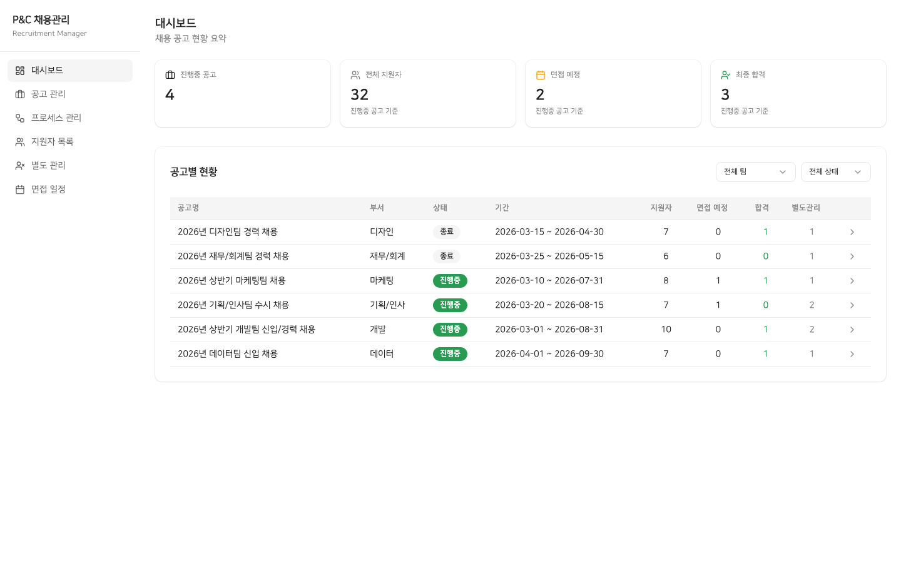

관련 정책: [§2.1](#21-공고-상태진행중종료-자동-판정-규칙)(공고 상태 자동 판정 규칙), [§2.9](#29-면접-예정지난-면접완료-판정-기준)(면접 예정/지난 면접/완료 판정 기준), [§2.11](#211-최종-결과finalresult와-전형-구조의-분리)(최종 결과와 전형 구조의 분리)

**목적**: 전체 채용 현황을 한 화면에서 파악하는 진입 화면.

**주요 요소**
- 요약 카드 4개: 진행중 공고 수 / 전체 지원자 / 면접 예정 / 최종 합격. 뒤 3개 카드는 **"진행중 공고" 소속 지원자만 집계**하고 카드 아래에 "진행중 공고 기준" 문구를 명시한다(2026-07-14 변경 — 예전에는 종료된 공고까지 포함했음).
- 공고별 현황 테이블: 모집 분야/게시상태 필터, 마감일 임박순(종료일 오름차순) 기본 정렬. 이 테이블은 **종료된 공고도 포함**하며(카드와 달리), 필터로 진행중/종료를 구분해서 볼 수 있다.

**사용자 액션과 결과**
- 모집 분야/상태 필터 변경 → 테이블만 필터링(카드 수치는 항상 "진행중 공고 전체" 기준으로 고정, 필터의 영향을 받지 않음).
- 테이블 행 클릭 → 공고 상세로 이동.
- "지원자" 수 클릭 → `/applicants?posting={공고id}`로 이동.
- "별도관리" 수 클릭 → `/separate-management?posting={공고id}`로 이동.

**다른 화면과의 연결**: → 공고 상세, → 지원자 목록(쿼리 `posting`), → 별도 관리(쿼리 `posting`).

### 3.2 공고 관리 (`/postings`)

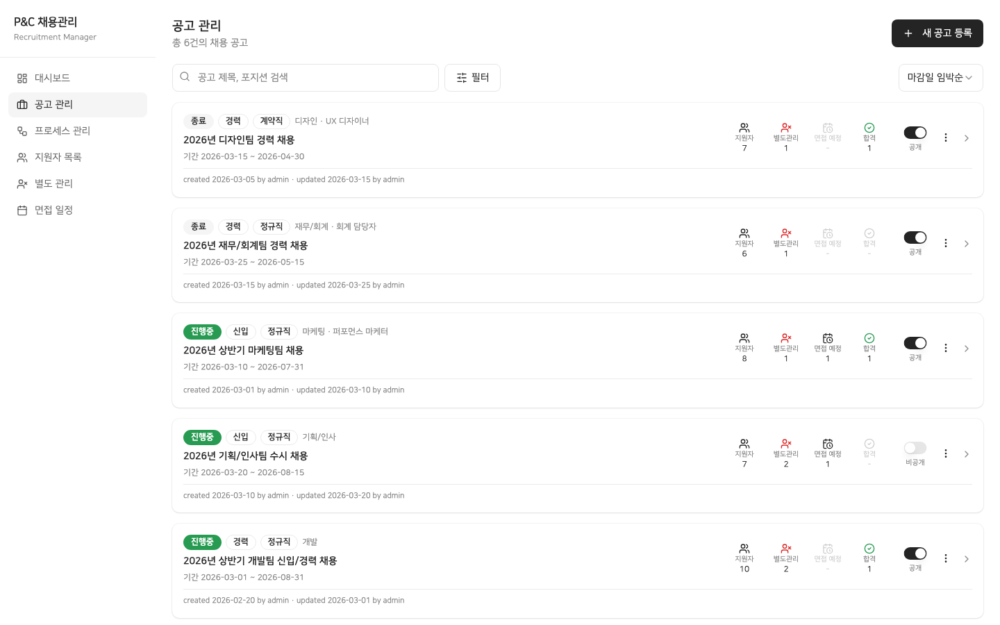

관련 정책: [§2.1](#21-공고-상태진행중종료-자동-판정-규칙)(공고 상태 자동 판정 규칙), [§2.2](#22-전형-단계상태의-소유-구조와-프리셋-복사-규칙)(전형 단계/상태의 소유 구조와 프리셋 복사 규칙)

**목적**: 채용 공고 등록/수정/삭제 및 목록 열람.

**주요 요소**
- 검색(제목/모집 분야), 필터 팝오버(게시상태/고용형태/모집 분야), 정렬(마감일 임박순 기본값 포함 7종: 마감일 임박순/최신 생성순/오래된 생성순/최근 수정순/지원자 많은 순/지원자 적은 순/게시중 우선).
- 공고 카드 목록: 3구역 그리드 레이아웃이다 — (1) 좌측 가변폭 정보 열(상태/구분/고용형태 뱃지 + 모집 분야, 제목, "기간 {시작일} ~ {종료일}"), (2) 중앙 고정폭 지표 열(지원자/별도관리/면접 예정/합격 4개를 아이콘+라벨+숫자 3단으로 표시하는 `StatItem` — 뱃지가 아니라 지표 타일이며, 값이 0이면 "-"로 흐리게 표시해 지표 유무가 다른 카드끼리도 열이 어긋나지 않게 함, 지원자·별도관리 타일은 클릭 시 해당 화면으로 이동), (3) 우측 고정폭 조작 열(공개 여부 토글, "⋮" 메뉴, 상세 이동 화살표). 하단에 생성/수정 메타(일자·작성자)가 풀폭으로 붙는다.
- 등록/수정 폼의 "모집 분야"는 자동완성 인풋(`FieldAutocomplete`, 2026-07-21)이다 — 이미 등록된 공고들의 `field` 값 중 입력하는 대로 매칭되는 것만 추천 목록으로 보여주고, 목록에 없는 새 값도 항상 그대로 입력할 수 있다(별도로 관리되는 마스터 데이터는 없음). "게시기간"은 시작일·종료일 입력 두 칸이 아니라 **캘린더 하나에서 시작일 클릭 → 종료일 클릭으로 기간을 고르는 range 모드 선택기**(`DateRangePicker`, shadcn Calendar 기반)다. 지원자 등록 폼의 생년월일·지원일처럼 기간이 아닌 단일 날짜는 같은 캘린더의 single 모드(`DatePicker`)를 쓴다. 폼 하단의 "자기소개서 문항" 빌더에서 문항을 추가/삭제/순서 변경(위아래 화살표)하고 문항별 최대 글자수를 지정할 수 있다(2.8).

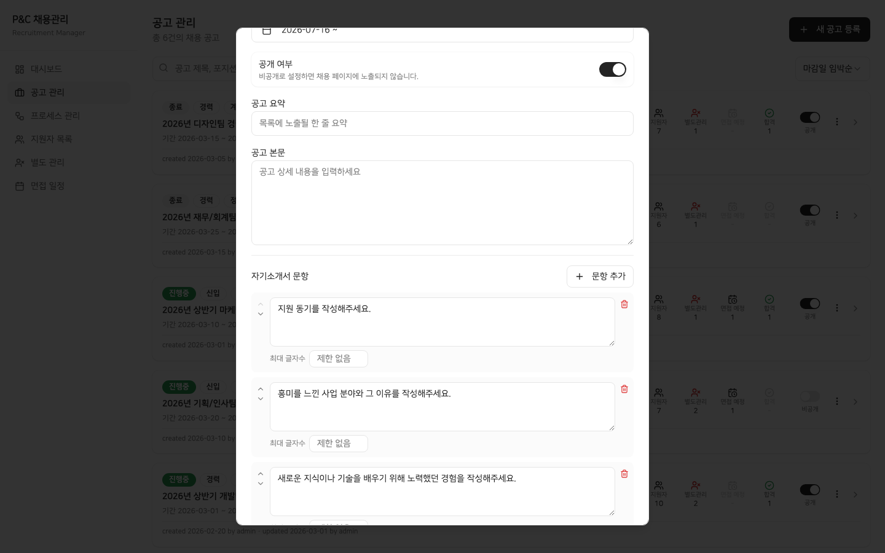

**사용자 액션과 결과**
- 카드에서 토글·인원수·메뉴를 제외한 영역 클릭 → 공고 상세로 이동.
- 공개 토글 → `isPublic`만 즉시 반영(그 외 필드 변경 없음).
- "지원자"/"별도관리" 인원수 클릭 → 각각 `/applicants?posting=`, `/separate-management?posting=`으로 이동.
- "새 공고 등록" → 등록 폼 제출 시, **그 시점의 기본 프로세스 프리셋을 복사**해 `stages`를 채운 공고가 생성된다(2.2).
- 카드 메뉴의 "수정" → 같은 폼을 기존 값으로 열되, **`stages`는 이 폼에서 다루지 않으므로 그대로 유지**된다.
- 카드 메뉴의 "삭제" → 확인 다이얼로그 후, 소속 지원자를 모두 먼저 삭제하고 공고를 삭제한다(되돌릴 수 없음).

**다른 화면과의 연결**: → 공고 상세, → 지원자 목록/별도 관리(쿼리 `posting`).

### 3.3 공고 상세 (`/postings/:id`)

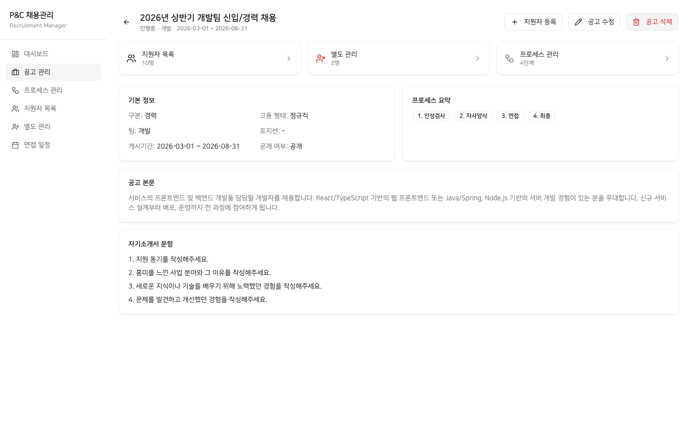

관련 정책: [§2.2](#22-전형-단계상태의-소유-구조와-프리셋-복사-규칙)(전형 단계/상태의 소유 구조와 프리셋 복사 규칙), [§2.8](#28-자기소개서-문항-참조-방식과-삭제-시-표시-규칙)(자기소개서 문항 참조 방식과 삭제 시 표시 규칙)

**목적**: 특정 공고를 중심으로 관련 화면들을 오가는 허브.

**주요 요소**: 기본 정보(구분/고용형태/모집 분야/게시기간/공개여부), 프로세스 요약(단계 이름을 순서대로 뱃지로 나열, 읽기 전용), 공고 본문, 자기소개서 문항 목록, 바로가기 카드 3개(지원자 목록/별도 관리/프로세스 관리 — 각각 인원수·단계수 함께 표시), 지원자 등록/공고 수정/공고 삭제 버튼.

**사용자 액션과 결과**
- 바로가기 카드 클릭 → 각각 `/applicants?posting=`, `/separate-management?posting=`, `/process-management?posting=`으로 이동(모두 이 공고가 선택된 채로 진입).
- "지원자 등록" → 이 공고가 기본 선택된 상태로 지원자 등록 폼이 열린다.
- "공고 삭제" → 확인 후 소속 지원자 cascade 삭제, 공고 목록으로 이동.

**다른 화면과의 연결**: 위 3개 화면과 `posting` 쿼리로 연결.

### 3.4 프로세스 관리 (`/process-management`, 쿼리: `posting`)

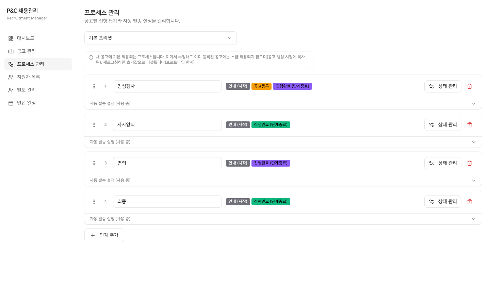

관련 정책: [§2.2](#22-전형-단계상태의-소유-구조와-프리셋-복사-규칙)(전형 단계/상태의 소유 구조와 프리셋 복사 규칙), [§2.3](#23-상태-플래그시작단계종료의-의미와-집계)(상태 플래그의 의미와 집계), [§2.12](#212-상태-플래그-자동-관리-규칙)(상태 플래그 자동 관리 규칙), [§2.14](#214-상태값단계-삭제-시-지원자-이동-규칙)(상태값/단계 삭제 시 지원자 이동 규칙)

**목적**: 공고별 전형 단계/상태/발송 메시지 설정 편집, 그리고 신규 공고에 적용될 "기본 프로세스 프리셋" 편집.

**주요 요소**
- 공고 선택 셀렉트: 맨 위에 고정된 "기본 프리셋" 항목 + 공고 목록. **최초 진입(쿼리 없음) 시 기본값은 "기본 프리셋"이다**(예전에는 첫 번째 공고가 기본값이었으나 2026-07-14 변경).
- "기본 프리셋" 선택 시 안내 배너("새 공고에 기본 적용되는 프로세스입니다 … 새로고침하면 초기값으로 리셋됩니다") 노출.
- 단계 카드 목록: 좌측 도트 드래그 핸들로 순서 변경(StageStatusModal의 상태값 순서 변경과 동일한 패턴 — 핸들에서 시작한 드래그만 인정, 드래그 중인 카드는 반투명, 놓일 위치는 삽입선으로 표시), 이름(인라인 편집), 현재 상태값 뱃지 나열, "상태 관리" 버튼, 삭제 버튼(단계가 1개뿐이면 비활성 + "최소 1개의 단계가 필요합니다" 툴팁), 아코디언 형태의 "발송 메시지 설정"(자동 발송 사용 중이면 라벨에 표시. 템플릿 폼은 토글과 무관하게 항상 노출되고 토글은 자동 발송 여부만 담당한다, 2.15). (단계에는 "구분" 셀렉트가 없다 — 단계별 합불 판정 개념 자체가 폐지됐기 때문에 2.3. "완료 입력폼" 셀렉트도 없다 — 날짜 입력 트리거가 단계가 아니라 상태 속성(`hasDateInput`)으로 옮겨갔기 때문에 2.4.)
- 하단 "단계 추가" 폼(이름만 입력 — 구분·완료 입력폼 지정 항목 없음).
- **상태 관리 모달**(아래 스크린샷): 각 상태 행은 도트 드래그 핸들(왼쪽, 행 전체 높이) + 2줄 구조다 — 1줄(이름 입력 · 목록 맨 위에만 붙는 "시작" 배지 · 목록 맨 아래에만 붙는 "종료" 배지, 2.12), 2줄(왼쪽 색상 스와치, 우측 정렬된 "날짜+메모" 체크박스와 삭제 버튼 — 상태가 1개뿐이면 비활성 + "최소 1개의 상태가 필요합니다" 툴팁). 순서는 핸들을 드래그해서 바꾸며(핸들에서 시작한 드래그만 인정 — 이름 입력창의 텍스트 선택과 충돌하지 않도록), 드래그 중인 행은 반투명, 놓일 위치는 삽입선으로 표시된다. 삭제 버튼을 누르면 영향받는 지원자 수와 이동 안내를 보여주는 확인 모달이 뜨고(2.14), 확인 즉시(모달 하단의 "저장" 버튼을 기다리지 않고) 지원자 이동과 상태 목록 저장이 함께 반영된다. 그 외 항목은 없다 — "구분" 셀렉트와 "합격으로"/"불합격으로" 버튼은 2026-07-15 course-correction으로, "단계종료" 체크박스는 2026-07-17에 위치 기반 자동화로 대체되며 제거됐다.

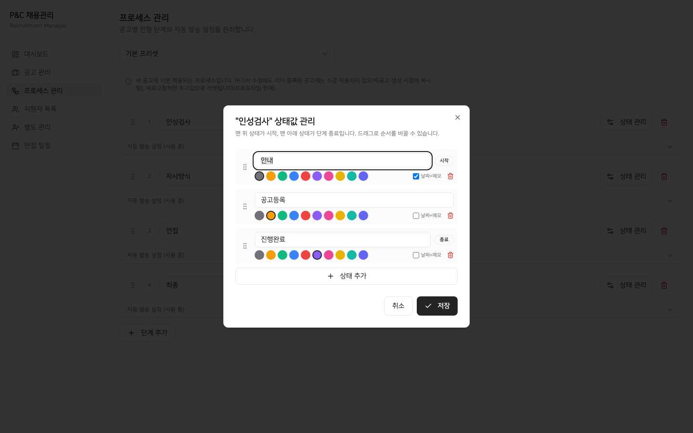

**사용자 액션과 결과**
- 셀렉트에서 공고 ↔ 기본 프리셋 전환 → 편집 대상만 바뀌고 URL의 `posting` 쿼리가 함께 갱신된다.
- 단계 이름 변경, 순서 이동, 추가 → 프리셋 모드면 전역 프리셋 상태를, 공고 모드면 그 공고의 `stages`를 갱신한다(2.2 참고). 새로 추가하는 단계는 항상 대기·진행중·완료 기본 상태 세트(`progressStatuses()`)를 자동으로 갖고 시작한다 — `hasDateInput`은 꺼진 채로 시작하므로, 날짜 입력이 필요하면 상태 관리에서 직접 켜야 한다(2.4).
- "상태 관리" → 그 단계의 상태값 편집 모달. 드래그 핸들로 순서를 바꾸면 시작/종료 상태도 위치에 따라 자동으로 바뀐다(2.12). "날짜+메모" 체크는 그 상태로 바뀔 때 날짜 입력 모달이 뜨게 한다. 상태 삭제 확인 후에는 그 상태였던 지원자가 실제로 이동한다(2.14).

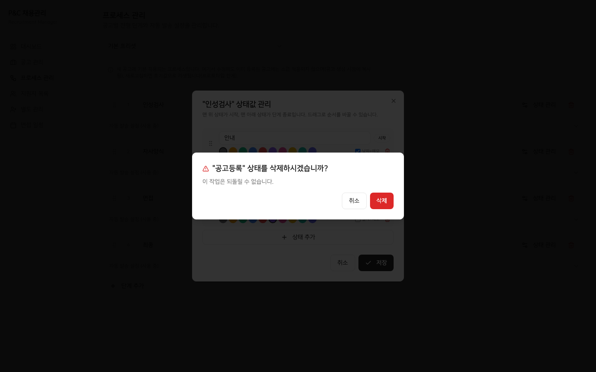

- 단계 삭제 확인 다이얼로그: 공고 모드에서는 영향받는 지원자 수와 이동처(다음/이전 단계)를 구체적으로 안내하고, 확인 시 실제로 이동시킨다. 프리셋 모드에서는 지원자 개념이 없으므로 "이후 생성되는 공고부터 적용됩니다" 안내만 보여준다(2.14).

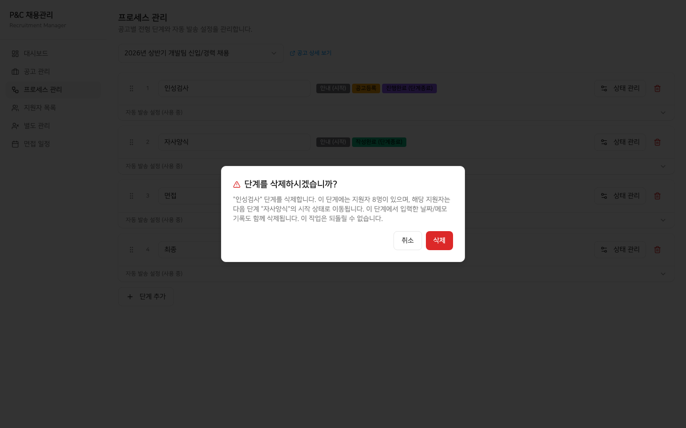

**다른 화면과의 연결**: 공고 상세/공고 카드에서 `posting` 쿼리로 진입. 프리셋에는 다른 화면에서 딥링크가 없고, 사이드바로 직접 들어왔을 때의 기본값으로만 노출된다.

### 3.5 지원자 목록 (`/applicants`, 쿼리: `posting`)

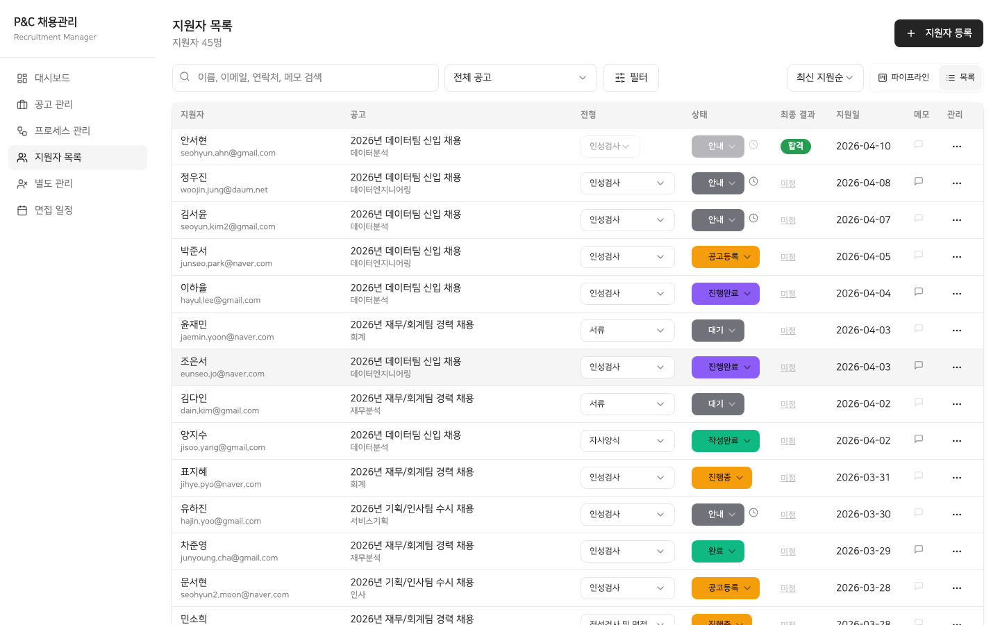

관련 정책: [§2.4](#24-날짜입력hasdateinput과-모달-트리거-조건)(날짜입력과 모달 트리거 조건), [§2.5](#25-현재-단계getcurrentstage-파생-규칙)(현재 단계 파생 규칙), [§2.6](#26-지원자-목록의-전형-단계-선택과-실제-기록-갱신의-관계)(전형 단계 선택과 실제 기록 갱신의 관계), [§2.7](#27-별도관리-이동복귀와-separatestageid-스냅샷-규칙)(별도관리 이동/복귀), [§2.11](#211-최종-결과finalresult와-전형-구조의-분리)(최종 결과와 전형 구조의 분리), [§2.13](#213-최종-결과finalresult-지정-시-전형-조작-ui-잠금)(최종 결과 지정 시 전형 조작 UI 잠금)

**목적**: 전체 또는 특정 공고의 지원자를 목록/그룹/파이프라인 세 형태로 열람하고 전형 상태를 인라인으로 바꾼다.

**주요 요소**
- 검색(이름/이메일/연락처/메모), 공고 셀렉트(전체+개별), 필터 팝오버(모집 분야/현재 단계/상태 — 단계·상태는 공고를 선택했을 때만 활성화. **모집 분야 옵션은 지원자 개별 필드가 아니라 소속 공고의 `field` 값 기준으로 만들어진다** — 2026-07-21 이전에는 `Applicant.team`이라는 별도 필드 기준이었다), 정렬(최신 지원순 기본/오래된 지원순/이름순 — `applicationDate` 기준, `ApplicantSortOption`), 목록/그룹/파이프라인 3단 토글(이 순서로 나열), "지원자 등록" 버튼.
- **목록형**: 지원자명(클릭 시 상세로 이동)·이메일, 공고/팀, "전형" 셀렉트(2.6에서 설명한 대로 보기 전용 선택), "상태" 셀렉트(`hasDateInput` 상태로 바꾸면 모달), **"최종 결과"**(미정이면 흐린 "미정" 버튼, 지정되면 합격=success/불합격=destructive 배지만 표시 — 메모는 별도 아이콘 없이 배지를 클릭해 여는 `FinalResultModal` 안에서만 확인·수정한다. 지원자 메모(memo) 컬럼의 말풍선 아이콘과 시각적으로 혼동되는 것을 막기 위함이다. 클릭하면 항상 이 모달이 열려 새로 지정하거나 고치거나 "판정 해제"로 되돌릴 수 있다, 2.11), 지원일(줄바꿈 방지), 메모 아이콘(메모 있으면 진하게·없으면 흐리게 표시하되 항상 노출, 클릭 시 메모 보기/작성 모달), "..." 메뉴(상세보기/별도관리 이동(사유 자유 입력 모달, 2.7)/삭제). 상태 셀렉트 옆에는 기록 존재 기반의 시계 아이콘(기록 없으면 흐리게, 있으면 진하게, 2.4)과 발송 기록이 있을 때의 메일 아이콘이 붙는다. `finalResult`가 지정된 행은 "전형"·"상태" 셀렉트가 잠기지만, 기록이 있는 시계 아이콘은 열람 전용 모달로 계속 열 수 있다(2.13).
- **그룹형** (`ApplicantGroupedView`, 2026-07-21 도입): "전체 공고를 통틀어 오늘 처리할 지원자를 한눈에" 찾는 용도. 공고 필터(단일 선택)로는 여러 공고를 동시에 볼 수 없고, 목록형의 뒤섞인 플랫 목록으로는 공고별로 덩어리져 보이지 않는다는 두 한계를 모두 피하기 위한 세 번째 형태다.
  - **공고별 섹션**: 필터링된 지원자를 소속 공고 기준으로 묶어 섹션을 만든다(해당 공고에 지원자가 0명이면 섹션 자체를 만들지 않는다). 각 섹션 헤더에 공고 진행 상태 뱃지(진행중/종료, `getJobPostingStatus`), 공고명, 모집 분야, 지원자 수, **"처리 필요" 배지**(`finalResult`가 아직 없는 지원자 수)를 보여준다.
  - **섹션 순서**: 진행중인 공고는 마감일(`endDate`) 오름차순(임박한 공고가 위)으로 나열한다. 종료된 공고는 별도의 접힌 아코디언("종료된 공고 (N)")으로 하단에 모아 기본적으로 숨겨둔다.
  - **섹션 내 지원자 정렬**: 2단계 규칙 — ① `finalResult`가 확정된 지원자는 항상 맨 아래(카드 전체를 흐리게 표시하고 합격/불합격 배지를 이름 옆에 붙인다). ② 미확정 지원자 중에서는 "현재 상태가 `hasDateInput`인데 아직 그 단계에 meta 기록이 없는" 지원자(= 안내가 필요한 사람)가 우선하고, 나머지는 지원일(`applicationDate`) 최신순이다. 이 규칙은 목록형·상세의 시계 아이콘 노출 판단(2.4)과 같은 "기록 존재" 개념을 재사용한다.
  - **지원자 카드**: 이름(클릭 없이도 카드 전체가 클릭 영역)·이메일, 현재 전형·상태를 하나의 배지로("{전형명} · {상태명}"), 기록 존재 기반의 시계 아이콘(클릭 시 목록형과 동일한 `CompletionDateModal`이 열려 그 자리에서 날짜/메모/발송을 입력·확인할 수 있다 — 최종 결과로 잠긴 지원자는 기록이 있으면 열람 전용, 없으면 비활성, 2.13), 발송 기록이 있을 때의 메일 아이콘, 메모 아이콘(클릭 시 `MemoModal`). 아이콘 클릭은 이벤트 버블링을 막아 카드 자체의 상세 이동과 충돌하지 않는다. 카드 영역(아이콘 제외) 클릭 시 `/applicants/:id`로 이동한다.
  - **검색**: 상단 검색창은 뷰 전환과 무관하게 항상 전체 공고에 걸쳐 동작하므로, 그룹형에서도 검색 결과가 여러 공고 섹션에 걸쳐 그대로 나타난다.
  - **기본 진입 뷰**: 특정 공고를 지정하지 않고 들어오면(사이드바 "지원자 목록" 클릭 등) 그룹형이 기본이다 — 이 화면에 처음 들어오는 의도가 대개 "오늘 처리할 것부터 찾기"이기 때문에, 전체를 훑어보기 좋은 그룹형을 우선 보여준다. 반면 공고 상세 허브의 "지원자 목록" 카드처럼 **특정 공고가 이미 선택된 채로** 진입하면(`?posting=` 쿼리가 있는 최초 로드) 자동으로 목록형으로 전환된다 — 한 공고만 볼 때는 그룹 섹션이 하나뿐이라 의미가 없고, 개별 상태를 바로 바꾸는 목록형이 더 적합하기 때문이다. 이 기본값 결정은 **최초 마운트 시 한 번만** 적용되며, 이후 사용자가 토글을 직접 눌러 뷰를 바꾸면 검색/필터/정렬 상태를 그대로 유지한 채 그 선택이 유지된다(공고 셀렉트를 바꾸는 것만으로 뷰가 자동으로 바뀌지는 않는다).
- **파이프라인형**(공고를 선택했을 때만 노출): 단계별 칸반 컬럼(`getCurrentStage` 기준으로 카드 배치), 드래그 앤 드롭으로 다른 단계 컬럼에 놓으면 그 단계로 이동(2.6), 카드 메뉴로도 동일하게 이동 가능. `finalResult`가 지정된 카드는 드래그가 되지 않고 흐리게 표시되며, 메뉴의 "다른 단계로 이동"은 잠금 안내 문구로 바뀐다(2.13).

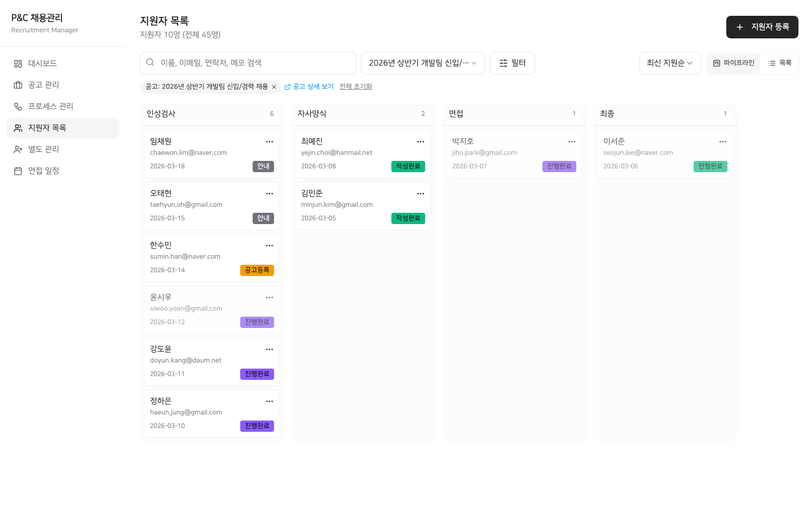

**사용자 액션과 결과**
- 상태 변경 → `hasDateInput`이 꺼진 상태로의 전이는 즉시 반영, 켜진 상태로의 전이는 모달 입력 후 반영. 모달 하단에는 그 단계의 안내 메시지 발송 섹션(변수 치환 미리보기 + 발송 버튼)이 함께 뜨고, 자동 발송이 켜진 단계는 확인 시 발송 기록이 자동 생성된다(2.15).

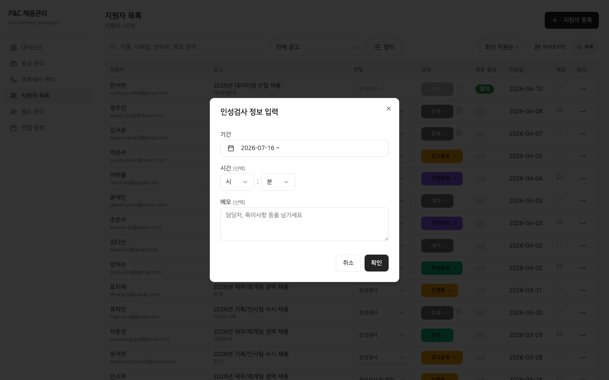

- 최종 결과 지정/수정/해제 → 저장 즉시 그 행의 배지가 바뀐다. 이 조작은 `stageRecords`를 전혀 건드리지 않는다(2.11). 지정하는 순간 그 지원자의 전형 조작 UI가 잠기고, 해제하는 순간 다시 풀린다(2.13).

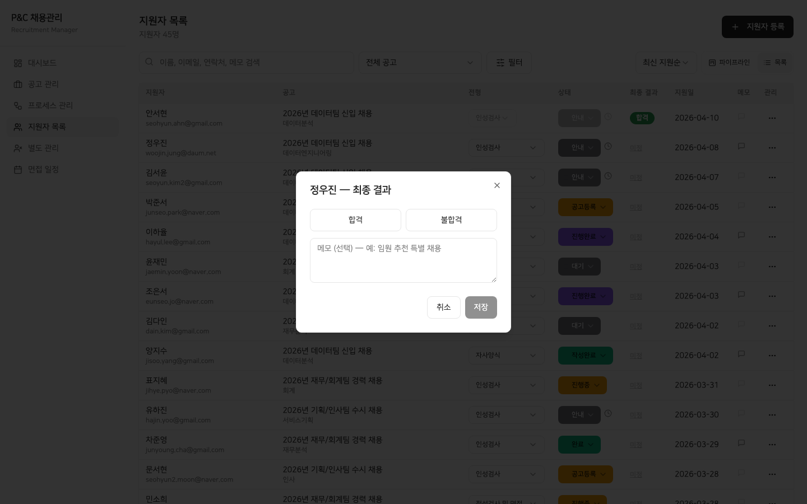

- 메모 저장 → 저장 즉시 그 행의 메모 아이콘 진하기가 바뀐다.
- 별도관리 이동 → 모달에 사유를 입력하고 저장하면 이 목록에서 사라지고 별도 관리 화면으로 옮겨간다(2.7).

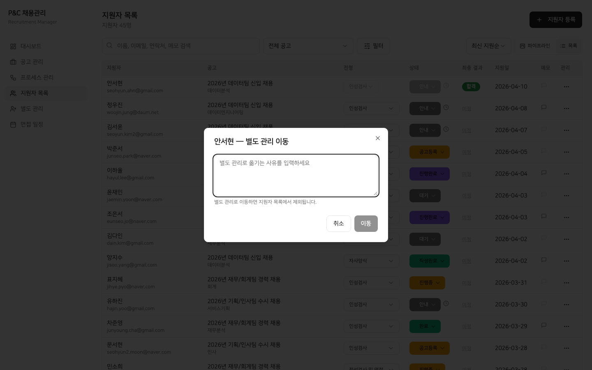

**다른 화면과의 연결**: 지원자명 클릭 → `/applicants/:id`. 필터 칩의 "공고 상세 보기" 링크 → `/postings/:id`. 공고 선택은 URL `posting` 쿼리와 항상 동기화된다.

### 3.6 지원자 상세 (`/applicants/:id`)

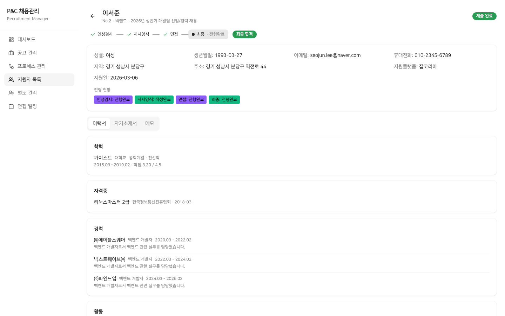

관련 정책: [§2.5](#25-현재-단계getcurrentstage-파생-규칙)(현재 단계 파생 규칙), [§2.8](#28-자기소개서-문항-참조-방식과-삭제-시-표시-규칙)(자기소개서 문항 참조 방식), [§2.11](#211-최종-결과finalresult와-전형-구조의-분리)(최종 결과와 전형 구조의 분리), [§2.13](#213-최종-결과finalresult-지정-시-전형-조작-ui-잠금)(최종 결과 지정 시 전형 조작 UI 잠금)

**목적**: 지원자 1인의 전체 정보 열람 및 이력서/자소서/메모/첨부파일 관리.

**주요 요소**: 상단 요약(이름/사번(`no`)/소속 공고의 모집 분야/공고/제출상태 뱃지), **진행 스테퍼**(아래 설명), 전체 단계를 순서대로 나열한 "전형 현황" 뱃지 목록(시계 아이콘은 "hasDateInput 상태이거나 기록 존재"면 노출 — 기록 없으면 흐리게, 있으면 진하게, 2.4. 발송 기록이 있으면 메일 아이콘도 함께 노출. `finalResult`가 지정되면 기록이 있는 시계는 열람 전용 모달로 열리고 기록 없는 시계만 비활성, 2.13), 기본 정보 카드, 탭 3개(이력서/자기소개서/메모).

- **진행 스테퍼**: 공고의 단계를 순서대로 나열해 지나온 단계는 체크 표시, 현재 단계(`getCurrentStage`)는 강조 표시하며 현재 상태 이름을 함께 보여주고, 남은 단계는 흐리게 표시한다. 발송 기록(`meta.send`)이 있는 단계에는 발송 아이콘이 추가로 붙고, 아이콘 툴팁에서 "발송됨/자동 발송됨 날짜 · 채널"을 확인할 수 있다(2.15). 공고마다 실제 `stages` 구성을 그대로 따르므로(하드코딩된 4개 이름이 아님), job-05처럼 다른 구성의 공고에서도 그 공고의 단계 이름으로 동작한다. `finalResult`가 지정된 지원자는 스테퍼 옆에 "최종 합격"/"최종 불합격" 배지가 추가로 붙는데, 이 배지는 스테퍼가 보여주는 진행 상황과 **무관하게** 뜬다 — 특별 채용처럼 모든 단계가 아직 시작 상태인 지원자도 이 배지만 따로 뜰 수 있다(2.11).
- **이력서 탭**: 학력/자격증/경력/활동/통계패키지/논문 섹션을 순서대로 표시(값이 없으면 "등록된 ~이 없습니다" 안내). 이 화면에는 편집 UI가 전혀 없고(읽기 전용), 데이터를 만드는 곳은 등록 폼(학교·전공만) 또는 시드 데이터뿐이다.
- **자기소개서 탭**: 문항-답변 매칭 및 삭제된 문항 표시는 2.8 참고.
- **메모 탭**: 텍스트 저장(목록의 메모 모달과 별개의 입력 상태를 가지며, 저장 버튼을 눌러야 반영됨), 첨부파일 업로드/삭제(브라우저 세션 한정).

**다른 화면과의 연결**: 브라우저 히스토리로 뒤로가기. 지원자 목록/파이프라인/메모 모달의 지원자명 또는 "상세에서 관리" 링크로 진입.

### 3.7 별도 관리 (`/separate-management`, 쿼리: `posting`)

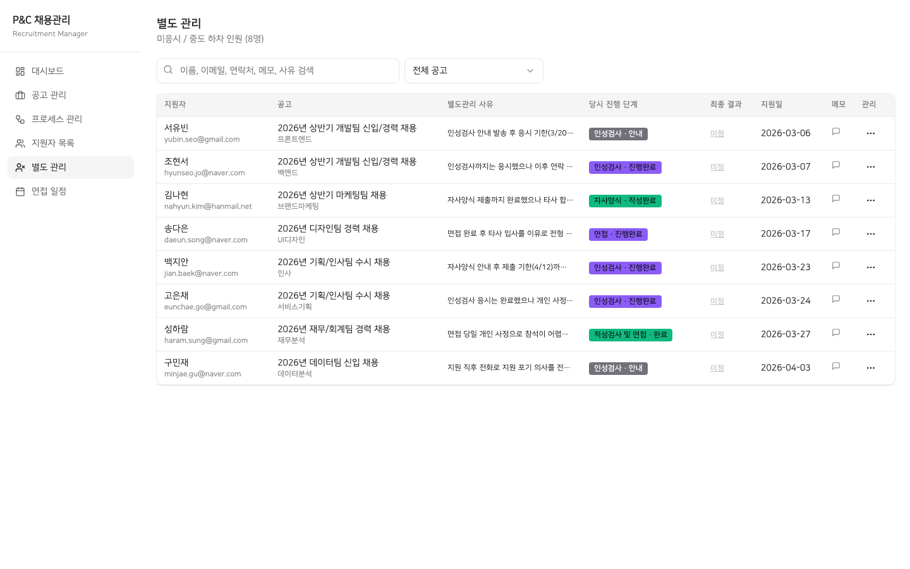

관련 정책: [§2.7](#27-별도관리-이동복귀와-separatestageid-스냅샷-규칙)(별도관리 이동/복귀와 separateStageId 스냅샷 규칙)

**목적**: 미응시·중도포기 등으로 별도관리 전환된 지원자만 모아 열람.

**주요 요소**: 검색(이름/이메일/연락처/메모/별도관리 사유 — 사유가 자유 텍스트가 되면서 검색 대상에 포함시켰다, 2.7), 공고 셀렉트, **정렬**(별도관리 전용 옵션 — 아래 설명), 지원자 목록과 같은 테이블 컴포넌트를 `mode="separate"`로 재사용(전형/상태 셀렉트 대신 "별도관리 사유"를 한 줄 말줄임으로 표시하고 클릭하면 전문 확인+수정 모달이 열리며, "당시 진행 단계" — 2.7의 스냅샷 — 를 표시하되, "최종 결과" 컬럼과 메모 아이콘은 지원자 목록과 동일하게 노출됨), "..." 메뉴(상세보기/복귀/삭제). "당시 진행 단계" 셀에는 그 단계에 meta 기록이 있으면 시계 아이콘(클릭 시 **열람 전용** 모달 — 이 화면에서는 전형 조작이 원래 없으므로 항상 읽기 전용)과, 발송 기록이 있으면 메일 아이콘이 함께 노출된다(2.4의 기록 존재 기반 규칙). 사유가 자유 텍스트라 고정 선택지를 전제로 한 사유 필터 셀렉트는 없앴다.

**정렬 기준은 지원자 목록과 완전히 별개다**(`SeparateSortOption`, 2026-07-20 결정): 별도관리는 "최근에 이탈한 사람"을 먼저 봐야 하므로 기본값이 **"최근 이동순"**(`separatedAt` 내림차순)이다. 그 외 "오래된 이동순"(`separatedAt` 오름차순), "지원일순"(`applicationDate` 내림차순 — 지원자 목록의 "최신 지원순"과 같은 방향)이 있다. `separatedAt`이 없는(레거시) 데이터는 타임스탬프 0(가장 오래됨)으로 취급해 정렬 양 끝 어느 쪽에서도 자연스럽게 처리된다. 이 화면은 `ApplicantToolbar`(지원자 목록의 툴바)를 공유하지 않고 처음부터 자체 툴바를 쓰고 있었으므로, 정렬 옵션의 분리는 새 컴포넌트 없이 이 화면 자체에 정렬 상태와 셀렉트를 추가하는 것으로 구현했다 — 공유되는 것은 오직 하단 테이블(`ApplicantOverviewTable`)뿐이다.

**사용자 액션과 결과**: 사유 클릭 → 이동 일시와 전문을 보여주는 모달에서 사유를 수정할 수 있다(2.7). "복귀" → 확인 다이얼로그 후 별도관리 관련 필드를 리셋하고 이 목록에서 사라져 지원자 목록으로 돌아간다. 메모 아이콘 클릭 동작은 지원자 목록과 동일하다.

**다른 화면과의 연결**: 공고를 선택하면 "공고 상세 보기" 링크가 노출된다. 지원자명 클릭 → 상세.

### 3.8 면접 일정 (`/interviews`)

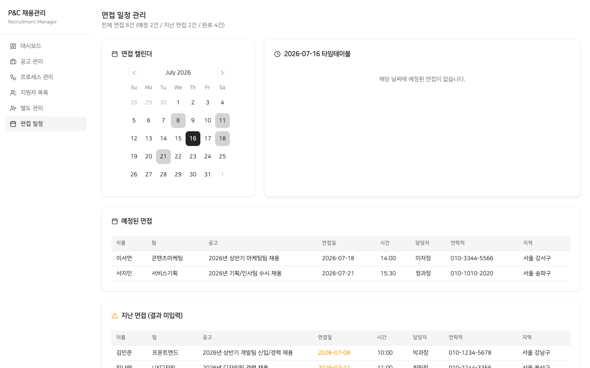

관련 정책: [§2.9](#29-면접-예정지난-면접완료-판정-기준)(면접 예정/지난 면접/완료 판정 기준)

**목적**: 별도관리 대상이 아니면서 면접 일정이 있는 지원자 중 아직 신경 써야 할 대상(예정/지난 면접)을 캘린더+타임테이블과 함께 열람하고, 결과 입력이 밀린 건은 바로 처리한다.

**주요 요소**: 면접이 있는 날짜가 강조 표시되는 캘린더(2.9의 `getInterviewInfo` 대상 전체 기준 — 완료된 면접 날짜도 포함), 선택한 날짜의 09~18시 타임테이블(완료된 면접이 있으면 합격/불합격 배지 표시), 테이블 2개 — "예정된 면접"(열람 전용), "지난 면접 (결과 미입력)"(2.9의 `getInterviewInfo` 기준으로 분류). "담당자" 컬럼은 특정 단계에 종속되지 않은 범용 `meta.note` 값을 그대로 보여준다. **"면접 완료" 테이블은 2026-07-22 제거했다** — `finalResult`는 이미 지원자 목록/그룹 뷰/지원자 상세에서 확인할 수 있어, 완료된 면접만 다시 나열하는 세 번째 테이블은 정보 중복이었다.
- **"지난 면접 (결과 미입력)"은 이 화면에서 바로 처리할 수 있다** — 지원자명을 누르면 `/applicants/:id`로 이동하고, "최종 결과 입력" 버튼을 누르면 그 자리에서 `FinalResultModal`이 열려 합격/불합격을 지정할 수 있다. 저장하면 `finalResult`가 채워지면서 `getInterviewInfo`가 그 지원자를 즉시 `completed` 버킷으로 재분류하므로, 별도 새로고침 없이 이 테이블에서 바로 사라진다(2026-07-22 결정).

**사용자 액션과 결과**: 캘린더에서 날짜를 클릭하면 하단 타임테이블이 그 날짜 기준으로 갱신된다. "지난 면접" 행에서 최종 결과를 입력하면 그 행이 목록에서 사라진다. 그 외에는 상태를 바꾸는 UI가 없다 — 전형 단계 진행 자체는 지원자 목록/파이프라인/상세 화면에서만 가능하다.

**다른 화면과의 연결**: "지난 면접" 지원자명 클릭 → `/applicants/:id`.

---

## 4. 실제 구축 시 권장사항

`README.md`의 "현재 프로토타입의 한계"·"향후 테크팀 구축 시 참고할 점", `docs/decision-log.md`의 "재검토가 필요한 항목"들을 통합하고, 코드를 읽으며 추가로 발견한 사항을 더했습니다.

### 4.1 데이터 모델을 서버 스키마로 옮길 때

- `JobPosting.stages`/`Applicant.stageRecords`처럼 여러 단계를 배열/중첩 객체로 다루는 구조는 그대로 옮기지 말고, **단계별 이력 추적이 가능한 정규화된 테이블**(예: `recruitment_stages`, 상태 변경 이력 테이블)로 재설계하는 것을 권장합니다. 지금 구조로는 "언제 상태가 바뀌었는지"의 이력이 남지 않고 마지막 값으로만 덮어써집니다(변경 이력/감사 로그 없음).
- `StageStatus.isCompletion`/`hasDateInput`처럼 **"의미"를 명시적 플래그로 표현하는 패턴은 유지**하는 것을 권장합니다. 순서나 이름 문자열에 의존하는 방식은 단계를 재배치하거나 새로 추가하는 순간 오판정으로 이어지는 것을 이 프로토타입에서도 이미 겪었습니다(2026-07-13 decision-log). 다만 `Stage.stageType`과 `isPass`/`isFail`처럼 **"의미"가 늘어날수록 UI 복잡도가 함께 커지는 플래그는 도입에 신중해야 합니다** — 이 프로토타입에서도 그 조합이 상태 관리 화면의 개념을 다섯 개(시작/단계종료/날짜메모/합격으로/불합격으로)까지 늘려 결국 폐지했습니다(2026-07-15 decision-log 두 번째 항목).
- **최종 판정을 전형 진행 상태와 분리해서 별도 필드(`Applicant.finalResult`)로 둔 설계도 유지를 권장합니다.** 특별 채용처럼 정해진 절차를 다 거치지 않는 예외를, 절차 자체를 억지로 모델링하지 않고도 다룰 수 있게 해주기 때문입니다(2.11, 2026-07-15 decision-log).
- "기본 프로세스 프리셋"이 지금은 전역 하나뿐입니다. 직군별로 서로 다른 기본 프로세스가 필요해지면 이 단일 프리셋 구조를 다중화해야 합니다.
- `coverLetter[].questionId`, `stageRecords[].stageId`/`statusId` 같은 soft 참조를 실제 스키마에서는 FK 제약으로 만들지, 아니면 지금처럼 "참조 대상이 없어도 되는" 느슨한 참조로 유지하고 애플리케이션에서 폴백을 계속 처리할지 결정이 필요합니다. 후자를 유지한다면 2.10의 폴백 규칙을 서버 로직에도 동일하게 이식해야 합니다.

### 4.2 CRUD 로직·동시성·감사 이력

- `src/context/ApplicantContext.tsx`/`JobPostingContext.tsx`의 등록/수정/삭제 함수는 로컬 상태만 다루는 자리표시자이며, 실제 서버 연동 시 API 호출 기반으로 전면 재구현해야 합니다.
- 지원자 번호(`no`)는 "현재 목록의 최댓값 + 1"을 클라이언트에서 계산하는 방식이라 동시 등록 시 중복될 수 있습니다. DB 시퀀스나 유니크 제약으로 대체해야 합니다.
- 공고 삭제 시 소속 지원자를 함께 지우는 cascade는 클라이언트 코드가 흉내만 낸 것이라, 실제로는 DB 트랜잭션/외래키 제약(`ON DELETE CASCADE` 등)으로 옮겨야 합니다.
- 담당자별 변경 이력이 없습니다(`createdBy`/`updatedBy`는 항상 `"admin"` 고정값). 인증 도입과 함께 실제 사용자 단위 감사 로그를 추가해야 합니다.

### 4.3 인증/권한

로그인 기능이나 담당자별 권한 구분이 전혀 없습니다. 요구사항 정의 단계부터 새로 설계해야 합니다.

### 4.4 이 프로토타입에 아예 없는 기능

- **파일 첨부 영속화**: 첨부파일은 `URL.createObjectURL`로 만든 임시 blob URL만 쓰고 새로고침하면 사라집니다. 실제 파일 스토리지 연동이 필요합니다.
- **면접 평가표(스코어카드)**: 면접 단계는 진행 여부(안내/진행완료)만 기록하고, 면접관별 평가 항목·점수·의견 같은 정성적 기록 기능은 없습니다. 최종 합불은 면접 단계와 무관하게 `finalResult`로 따로 판단합니다(2.11).
- **오퍼/입사 관리**: 최종 합격 이후의 처우 협의, 입사일 확정 등 온보딩 프로세스는 다루지 않습니다.
- **알림/이메일 발송(실제 발송)**: 발송 메시지 설정, 변수 치환 미리보기(`src/lib/messageTemplate.ts`), 개별 발송 UX와 발송 기록(`meta.send`)까지는 있지만, 실제 메일/문자를 내보내는 로직은 없습니다(2.15 — "실제 발송 없이 발송 기록만 남습니다" 문구가 화면에 노출됨). 실제 연동 시 메일/SMS API 연동, 발송 이력 테이블(현재는 재발송 시 덮어씀), 회사명 등 설정값의 관리 화면이 필요합니다.
- **외부 지원 페이지**: `JobPosting.isPublic`은 토글 상태만 있고, 지원자가 실제로 접근해 지원서를 작성하는 외부 화면 자체가 없습니다(2차 범위로 decision-log에 기록됨 — 4.6 참고).

### 4.5 폼/화면에서 아직 다루지 않는 데이터

- 지원자 등록/수정 폼은 `educations`의 학교·전공 두 필드만 입력받고, 자격증·경력·활동·통계패키지·논문은 입력 UI가 전혀 없습니다(현재는 더미 시드 데이터에만 존재). 실 서비스에서 이 항목들을 운영자가 직접 입력해야 하는지, 아니면 지원자 본인 입력(4.6의 외부 지원 기능)으로만 채워질지 결정이 필요합니다.
- 등록 폼의 필수 검증은 이름·공고·성별 3개뿐이고, TypeScript 타입상 필수인 나머지 필드(생년월일·이메일·연락처·지역 등)는 런타임에 빈 값으로 저장될 수 있습니다. 실제 DB 제약(NOT NULL 여부)을 정할 때 이 차이를 그대로 가져가지 않도록 재검토가 필요합니다.
- `REGION_INTERVIEW_FEE`(지역별 면접비 지원 여부)는 정의만 되어 있고 사용되지 않는 매트릭스 뷰에서만 참조됩니다. 실제로 지원자 화면에 노출할지 결정이 필요합니다.
- 매트릭스(단계별 컬럼) 지원자 테이블(`src/components/applicant/ApplicantTable.tsx`)은 공고 상세 개편 이후 어디서도 렌더링되지 않지만, 재도입 검토 대상이라 삭제되지 않고 보존되어 있습니다.

### 4.6 아직 결정되지 않은 것으로 기록된 항목 (decision-log)

- **매트릭스 뷰 재도입 여부**: 제거된 단계별 컬럼 뷰를 다시 노출할지, 노출한다면 어느 화면에 넣을지 미정.
- **지원자 데이터 유입 방식**: 지금은 어드민이 폼으로 직접 입력해야만 지원자가 생성됩니다. 어드민이 이름/휴대전화/팀으로 사전 등록해두고 지원자가 동일 정보로 가입하면 매칭·승인되어 본인이 직접 지원서를 작성하는 방식이 검토 대상이며, 지금의 지원자 등록 모달이 그 사전 등록 단계의 원형으로 간주되고 있습니다. 불일치 시(오탈자, 번호 변경 등) 매칭 실패 처리와 본인 확인 수단은 아직 정해지지 않았고, 2차 범위인 "외부 지원 기능" 설계와 함께 다뤄야 합니다.
- **백엔드/DB/인증 방식**: 이 프로토타입의 범위 밖이며, 테크팀이 별도로 정해야 합니다.

---

## 부록: 상수/열거값 요약

| 이름 | 값 | 위치 |
|---|---|---|
| `JobPostingStatus` | `'진행중'`, `'종료'` | 파생값(저장 안 됨) |
| `CareerType` | `'신입'`, `'경력'` | |
| `EmploymentType` | `'정규직'`, `'계약직'`, `'인턴'` | |
| `Gender` | `'남성'`, `'여성'` | |
| `SubmissionStatus` | `'완료'`, `'미완료'` | |
| `FinalResult.result` | `'합격'`, `'불합격'` (또는 `finalResult` 전체가 `null`) | |
| `FINAL_RESULT_LOCK_MESSAGE` | `'최종 결과가 지정되어 전형이 종료된 지원자입니다.'` | 잠금 안내 문구(2.13) |
| `STAGE_COLOR_PALETTE` | 회색/주황/초록/파랑/빨강/보라/분홍/노랑/청록/남색 — 10종 고정 hex | |
| 기본 프리셋 4단계 | 인성검사(안내→공고등록→진행완료) → 자사양식(안내→작성완료) → 면접(안내→진행완료) → 최종(안내→전형완료). 각 단계 첫 상태가 시작 상태, **모든 상태가 `hasDateInput`**(2026-07-20), 각 단계의 마지막 상태(진행완료/작성완료/전형완료)만 `isCompletion`. 발송은 전 단계 자동 OFF·채널 이메일+문자. 합격/불합격 이름의 상태값은 프리셋 어디에도 없음(2026-07-16 decision-log) | `createDefaultStages()` |
