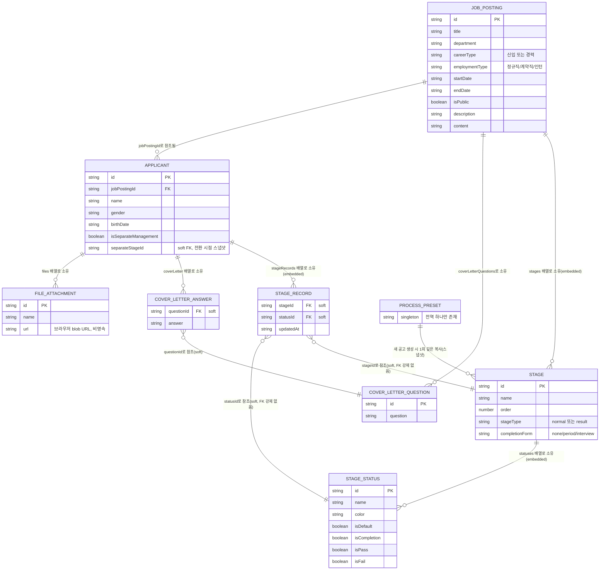

# P&C 채용관리 — 기능 명세서

## 문서의 목적과 범위

이 문서는 현재 리포지토리에 구현되어 있는 **프론트엔드 인메모리 프로토타입**(`src/`)의 동작을 코드 기준으로 정리한 기능 명세서입니다. 이 시스템을 실제 백엔드가 있는 서비스로 처음부터 다시 구현할 팀(테크팀)이 읽는다고 가정하고 작성했으며, 다음을 목표로 합니다.

- 화면 뒤에 숨어 있는 **데이터 구조**(도메인 모델)를 명확히 한다.
- 화면 곳곳에 흩어져 있는 **판정 로직**(예: "이 지원자는 면접 예정인가?")을 한 곳에 모아 문장으로 설명한다.
- 화면별로 "무엇을 할 수 있고, 그 결과 무엇이 바뀌는지"를 빠짐없이 적는다.
- 이 프로토타입의 한계와, 실제로 다시 만들 때 눈여겨봐야 할 지점을 정리한다.

이 문서는 **현재 코드가 실제로 하는 일**을 기준으로 작성되었습니다. `README.md`나 `docs/decision-log.md`에 남아 있는 설명 중 현재 코드와 다른 부분이 있다면, 이 문서는 코드 쪽을 따랐고 그 차이는 대화로 별도 보고했습니다.

---

## 1. 도메인 모델

이 시스템에는 정식 데이터베이스가 없습니다. 모든 데이터는 브라우저 메모리(React Context의 `useState`)에 있고, 새로고침하면 `src/data/dummyJobPostings.ts` · `src/data/dummyApplicants.ts`의 초기값으로 되돌아갑니다. 아래 모델은 "실제로 저장된 형태"가 아니라 "코드가 다루는 타입 구조"를 정리한 것입니다.

### 1.1 전체 구조 개요

**"soft" 참조에 대한 주의**: 위 다이어그램에서 `soft`라고 표시한 관계는 데이터베이스 외래키(FK)가 아니라, 문자열 id를 그대로 저장해두고 조회할 때마다 배열에서 `find`로 찾는 방식입니다. 참조 대상(예: 상태값, 자소서 문항)이 삭제되어도 참조하는 쪽의 레코드는 그대로 남고, 조회 로직이 "폴백" 또는 "삭제된 항목" 표시로 방어합니다. 이 폴백 규칙은 [2.10](#210-기록-없는-단계-삭제된-상태-참조-시-폴백-규칙)에서 다룹니다.

### 1.2 JobPosting (채용 공고)

| 필드 | 타입 | 필수 | 의미 / 제약 |
|---|---|---|---|
| `id` | string (uuid) | 필수 | PK |
| `title` | string | 필수 | 공고 제목 |
| `department` | string | 필수(자유 텍스트) | 팀/부서명. 정해진 목록이 아니라 자유 입력이며, 지원자의 `team` 필드 자동완성 소스로도 쓰임([2.2](#22-전형-단계상태의-소유-구조와-프리셋-복사-규칙) 아님, `ApplicantFormModal` 참고) |
| `careerType` | `'신입' \| '경력'` | 필수 | |
| `employmentType` | `'정규직' \| '계약직' \| '인턴'` | 필수 | |
| `position` | string | 선택 | 포지션명 |
| `startDate` / `endDate` | string (`YYYY-MM-DD`) | 필수 | `endDate`는 공고 상태 자동 판정([2.1](#21-공고-상태진행중종료-자동-판정-규칙))과 목록/대시보드의 기본 정렬(마감일 임박순) 기준으로 쓰임 |
| `isPublic` | boolean | 필수 | 공개 여부. 다만 이 프로토타입에는 지원자가 실제로 보는 "외부 공개 페이지"가 없어서, 이 값은 관리 화면의 토글 상태 그 이상의 효과는 없음 |
| `description` | string | 필수(빈 문자열 허용) | 목록에 노출되는 한 줄 요약 |
| `content` | string | 필수(빈 문자열 허용) | 공고 본문 |
| `coverLetterQuestions` | `CoverLetterQuestion[]` | 필수(빈 배열 허용) | 자기소개서 문항. 공고가 소유 |
| `stages` | `Stage[]` | 필수 | 전형 단계. **공고가 직접 소유**하며 다른 공고와 절대 공유되지 않음. 새 공고 생성 시 "기본 프로세스 프리셋"을 깊은 복사한 독립 사본으로 시작([2.2](#22-전형-단계상태의-소유-구조와-프리셋-복사-규칙)) |
| `createdBy` / `updatedBy` | string | 필수 | 현재는 항상 고정 문자열 `"admin"` — 실제 로그인/담당자 구분 없음 |
| `createdAt` / `updatedAt` | string (ISO datetime) | 필수 | |

**공고에는 "상태" 필드가 저장되어 있지 않습니다.** 진행중/종료는 항상 `endDate`와 현재 시각으로부터 매번 계산되는 파생값입니다([2.1](#21-공고-상태진행중종료-자동-판정-규칙)).

### 1.3 Stage (전형 단계)

`JobPosting.stages` 배열의 원소이며, 공고 하나가 여러 단계를 순서대로 갖습니다.

| 필드 | 타입 | 필수 | 의미 / 제약 |
|---|---|---|---|
| `id` | string (uuid) | 필수 | PK |
| `name` | string | 필수 | 단계 이름 (예: "인성검사 안내") |
| `order` | number | 필수 | 1부터 시작하는 순번. 화면의 위/아래 버튼으로만 바꿀 수 있고(직접 숫자 입력 UI 없음), 단계를 추가/삭제/이동할 때마다 전체 배열이 1..N으로 재계산됨 |
| `stageType` | `'normal' \| 'result'` | 필수 | `result`는 "이 단계에서 합불을 판정한다"는 의미를 명시적으로 표시. 순서상 마지막 단계라서가 아니라 이 플래그로 "합불 판정 단계"를 식별함([2.3](#23-상태-플래그시작완료합불의-의미와-집계)) |
| `completionForm` | `'none' \| 'period' \| 'interview'` | 필수 | 이 단계를 "완료" 처리할 때 추가 정보를 입력받는 방식([2.4](#24-완료-입력폼-3종과-모달-트리거-조건)) |
| `statuses` | `StageStatus[]` | 필수(최소 1개) | 이 단계 안에서 지원자가 가질 수 있는 상태값 목록 |
| `autoSend` | `AutoSendConfig` | 선택 | 이 단계 진입 시 발송할 안내 메시지 설정. **실제 발송 기능은 없고 설정을 저장만 함**(화면에도 "실제 발송은 이뤄지지 않습니다" 안내 문구가 있음) |

### 1.4 StageStatus (전형 상태값)

`Stage.statuses` 배열의 원소입니다.

| 필드 | 타입 | 필수 | 의미 / 제약 |
|---|---|---|---|
| `id` | string (uuid) | 필수 | PK |
| `name` | string | 필수 | 상태 이름 (예: "대기", "필요", "완료", "합격") |
| `color` | string | 필수 | 10종 고정 팔레트(`STAGE_COLOR_PALETTE`) 중 하나의 id. 배지 배경색으로 쓰이고, 글자색은 WCAG 명도 대비 계산으로 흰/검 중 자동 선택됨(`getContrastTextColor`) |
| `isDefault` | boolean | 선택 | "시작 상태" 플래그. 한 단계 안에 정확히 1개 있어야 정상 동작하며, 상태 관리 모달이 저장 시 하나도 없으면 첫 상태를 자동으로 기본으로 지정해 이 조건을 강제함 |
| `isCompletion` | boolean | 선택 | `normal` 단계에서 "처리 완료" 의미. 완료 입력폼 모달을 띄울지 판단하는 기준 |
| `isPass` | boolean | 선택 | `result` 단계에서 "합격" 의미 |
| `isFail` | boolean | 선택 | `result` 단계에서 "불합격" 의미 |

`isCompletion`/`isPass`/`isFail`은 한 단계 안에서 최대 1개 상태에만 있어야 자연스럽지만, **코드가 이를 강제로 검증하지는 않습니다.** 상태 관리 모달의 "완료로"/"합격으로"/"불합격으로" 버튼이 클릭 시 같은 단계의 다른 상태들의 해당 플래그를 함께 꺼주기 때문에 정상적인 조작 경로로는 항상 0개 또는 1개로 유지되지만, 데이터를 직접 조작하면 여러 개가 동시에 켜질 수 있는 여지가 있습니다.

### 1.5 Applicant (지원자)

| 필드 | 타입 | 필수 | 의미 / 제약 |
|---|---|---|---|
| `id` | string (uuid) | 필수 | PK |
| `no` | number | 필수 | 화면 표시용 순번. **DB 시퀀스가 아니라 "현재 목록의 최댓값 + 1"을 클라이언트가 계산**하는 방식이라 동시 등록 시 중복 가능성이 있음(4장 참고) |
| `jobPostingId` | string | 필수 | 소속 공고 FK. 참조 무결성이 DB로 강제되지 않고, 공고 삭제 시 애플리케이션 코드가 소속 지원자를 함께 지우는 방식으로 흉내만 냄 |
| `name` | string | **런타임 필수** | 등록 폼이 비어 있으면 제출을 막음 |
| `gender` | `'남성' \| '여성'` | **런타임 필수** | 등록 폼에 기본값이 없고(빈 플레이스홀더), 선택하지 않으면 제출 불가 |
| `team`/`birthDate`/`platform`/`email`/`phone`/`region`/`regionDetail`/`address` | string | 타입상 필수, **런타임 선택** | `name`/`jobPostingId`/`gender` 외에는 등록 폼이 값 검증을 하지 않아 빈 문자열로 저장될 수 있음. `team`은 공고 선택 시 그 공고의 `department`로 자동 채워지지만 이후 자유롭게 수정(빈 값으로 지우는 것도) 가능 |
| `educations` / `certificates` / `careers` / `activities` / `statisticsPackages` | 각 엔트리 배열 | 필수(빈 배열 허용) | 이력서 하위 섹션(구조는 1.7 참고). **등록/수정 폼에는 `educations`의 학교·전공 두 필드만 입력 UI가 있고, 나머지 4종은 화면에서 만들 수 없음**(더미 시드 데이터에만 존재) |
| `thesis` | `ThesisInfo` | 선택 | 논문 정보. 폼 입력 UI 없음(위와 동일한 사유) |
| `coverLetter` | `CoverLetterAnswer[]` | 필수(빈 배열 허용) | `questionId`로 `JobPosting.coverLetterQuestions`를 soft 참조([2.8](#28-자기소개서-문항-참조-방식과-삭제-시-표시-규칙)) |
| `submissionStatus` | `'완료' \| '미완료'` | 필수 | 신규 등록 시 항상 `'미완료'`로 시작하고, 이후 바꾸는 화면 기능은 없음(더미데이터에만 `'완료'` 값이 존재) |
| `memo` | string | 필수(빈 문자열 허용) | 지원자 목록의 메모 아이콘, 지원자 상세 메모 탭에서 편집 |
| `applicationDate` | string (`YYYY-MM-DD`) | 필수 | 지원자 목록 정렬(최신/오래된순) 기준 |
| `stageRecords` | `StageRecord[]` | 필수(빈 배열 허용) | 단계별 진행 기록([1.6](#16-stagerecord-단계별-진행-기록)) |
| `isSeparateManagement` | boolean | 필수 | 별도관리 여부 |
| `separateReason` | 7종 유니언 | 선택 | 별도관리로 전환될 때만 값이 채워짐 |
| `separateStageId` | string | 선택 | 별도관리 전환 시점의 단계 id 스냅샷([2.7](#27-별도관리-이동복귀와-separatestageid-스냅샷-규칙)) |
| `files` | `FileAttachment[]` | 필수(빈 배열 허용) | 첨부파일. `url`은 `URL.createObjectURL`로 만든 임시 blob URL이라 새로고침하면 무효화됨 |
| `createdAt` / `updatedAt` | string (ISO datetime) | 필수 | |

### 1.6 StageRecord (단계별 진행 기록)

`Applicant.stageRecords` 배열의 원소이며, "이 지원자가 이 단계에서 지금 어떤 상태인가"를 나타냅니다.

| 필드 | 타입 | 필수 | 의미 / 제약 |
|---|---|---|---|
| `stageId` | string | 필수 | `Stage.id`를 가리키는 soft 참조 |
| `statusId` | string | 필수 | `StageStatus.id`를 가리키는 soft 참조 |
| `meta` | `StageRecordMeta` | 선택 | `{ startDate?, endDate?, time?, interviewer? }`. 완료 입력폼을 거친 단계에만 채워짐 |
| `updatedAt` | string (ISO datetime) | 필수 | |

**제약**: 지원자 한 명당 같은 `stageId`에 대한 레코드는 최대 1개만 유지됩니다(상태 변경 로직이 "있으면 갱신, 없으면 추가"하는 upsert 방식). 지원자에게 아직 도달하지 않은 단계, 또는 지원자 생성 이후 새로 추가된 단계는 `stageRecords`에 항목 자체가 없을 수 있고, 이 경우의 처리는 [2.10](#210-기록-없는-단계-삭제된-상태-참조-시-폴백-규칙)에서 다룹니다.

### 1.7 그 외 임베디드 타입

| 타입 | 소속 | 필드 | 비고 |
|---|---|---|---|
| `CoverLetterQuestion` | `JobPosting.coverLetterQuestions[]` | `id`, `question`, `maxLength?` | |
| `CoverLetterAnswer` | `Applicant.coverLetter[]` | `questionId`, `answer` | `questionId`는 soft 참조 |
| `EducationEntry` | `Applicant.educations[]` | `schoolName`, `degree`(대학교/대학원), `period`, `majorField`, `major`, `minor?`, `gpa`, `gpaMax` | 폼에서는 `schoolName`/`major`만 입력 가능, 나머지는 저장 시 빈 값/기본값(`degree: '대학교'`, `gpa: 0`, `gpaMax: 4.5`)으로 채워짐 |
| `CertificateEntry` | `Applicant.certificates[]` | `name`, `issuer`, `acquiredDate` | 폼 UI 없음 |
| `CareerEntry` | `Applicant.careers[]` | `company`, `role`, `period`, `description` | 폼 UI 없음 |
| `ActivityEntry` | `Applicant.activities[]` | `name`, `role`, `organization`, `period`, `description` | 폼 UI 없음 |
| `StatisticsPackageEntry` | `Applicant.statisticsPackages[]` | `name`, `level`, `detail` | 폼 UI 없음 |
| `ThesisInfo` | `Applicant.thesis?` | `title`, `keyword`, `summary` | 폼 UI 없음 |
| `FileAttachment` | `Applicant.files[]` | `id`, `name`, `size`, `type`, `url`, `uploadedAt` | `url`은 비영속 blob URL |
| `AutoSendConfig` | `Stage.autoSend?` | `enabled`, `channels: ('email'\|'sms')[]`, `title`, `body` | 저장만 되고 실제 발송 없음 |

참고로 `Applicant.region`을 키로 하는 `REGION_INTERVIEW_FEE`(지역별 면접비 지원 여부 상수표)가 `src/types/applicant.ts`에 정의되어 있지만, 현재 사용되지 않는 매트릭스 뷰(`ApplicantTable.tsx`, 4장 참고)에서만 참조되고 실제 화면 어디에도 노출되지 않습니다.

### 1.8 ProcessPreset (기본 프로세스 프리셋)

`JobPosting`과 1:1로 연결되는 엔티티가 아니라, **앞으로 만들어질 모든 공고에 기본 적용되는 단일 템플릿**입니다. 필드는 `Stage[]` 하나(`presetStages`)뿐이며, React Context(`ProcessPresetContext`)에 전역 싱글턴으로 존재합니다. 새 공고를 생성하는 순간 이 배열을 깊은 복사(새 id 부여)해서 그 공고의 `stages`로 저장하며, 그 뒤로는 프리셋과 해당 공고가 완전히 독립적으로 움직입니다([2.2](#22-전형-단계상태의-소유-구조와-프리셋-복사-규칙)).

---

## 2. 핵심 정책

### 2.1 공고 상태(진행중/종료) 자동 판정 규칙

공고에는 상태를 저장하는 필드가 없습니다. `getJobPostingStatus(job, now)`가 호출될 때마다 다음 규칙으로 계산합니다.

- `endDate`가 비어 있으면 무조건 `'진행중'`.
- `endDate`가 있으면, `endDate`의 자정을 지난 23:59:59(`YYYY-MM-DDT23:59:59`)와 현재 시각을 비교해 **현재 시각이 이 시점을 지났으면 `'종료'`, 아니면 `'진행중'`**.

즉 마감일 당일 23:59:59까지는 진행중으로 취급됩니다. 상태는 이 두 값(`'진행중'`, `'종료'`)뿐이며, "시작일 이전이라 아직 게시되지 않음" 같은 별도 상태는 없습니다 — `startDate`는 정렬/표시용으로만 쓰이고 상태 판정에는 관여하지 않습니다.

### 2.2 전형 단계/상태의 소유 구조와 프리셋 복사 규칙

- `Stage`/`StageStatus`는 항상 특정 `JobPosting`에 속한 배열(`stages`)의 원소이며, 두 공고가 같은 `Stage` 객체를 공유하는 일은 없습니다.
- "기본 프로세스 프리셋"(1.8)은 이와 별개로 전역에 하나만 존재하며, 프로세스 관리 화면에서 공고를 선택하지 않은 상태(최초 진입 시 기본값)로 편집합니다.
- **새 공고를 생성하는 시점에만** 프리셋을 깊은 복사(`cloneStages`)해서 그 공고의 `stages`로 저장합니다. 이 복사는 모든 `Stage.id`와 `StageStatus.id`를 새로 발급하고 `autoSend` 설정도 값 복사하므로, 복사 이후에는 프리셋을 고치든 그 공고의 단계를 고치든 서로 전혀 영향을 주지 않습니다.
- **이미 생성된 공고에는 절대 소급 적용되지 않습니다.** 프리셋을 나중에 바꿔도 이미 존재하는 공고들의 `stages`는 그대로입니다.
- 프리셋은 순수 인메모리 상태라 새로고침하면 코드에 하드코딩된 기본 7단계(`createDefaultStages()`)로 초기화됩니다.
- 공고 수정 화면(`JobPostingFormModal`, 공고 관리/공고 상세에서 여는 수정 폼)에는 `stages`를 건드리는 입력 항목이 전혀 없습니다 — 전형 단계는 오직 프로세스 관리 화면에서만 편집합니다.

### 2.3 상태 플래그(시작/완료/합불)의 의미와 집계

- **`isDefault`("시작 상태")**: 지원자가 그 단계에 아직 아무 조치도 취해지지 않았을 때의 상태입니다. `getCurrentStage`(2.5)가 "이 단계는 아직 진행 전인가"를 판단하는 유일한 기준이 이 플래그입니다.
- **`isCompletion`("완료")**: `normal` 단계 전용 개념으로, "이 단계 처리가 끝났다"는 의미입니다. 명시적으로 지정된 상태가 없는 레거시 단계는 상태 목록의 마지막 항목으로 폴백합니다(`getCompletionStatus`). 이 플래그는 완료 입력폼 모달을 띄울지 판단하는 데 쓰입니다(2.4).
- **`isPass`/`isFail`("합격"/"불합격")**: `result` 단계 전용 개념입니다. 명시 지정이 없으면 이름이 정확히 "합격"/"불합격"인 상태로 폴백합니다(`getPassStatus`/`getFailStatus`).
- **최종 합불 판정 단계(`getFinalStage`)**: `stageType === 'result'`인 단계들 중 `order`가 가장 큰(=순서상 가장 나중) 단계입니다. "배열의 마지막 단계"가 아니라 "합불을 판정하는 단계 중 마지막"이므로, 면접 결과 뒤에 처우 협의 같은 `normal` 단계가 추가되어도 최종 판정 단계는 계속 면접 결과로 유지됩니다. `result` 단계가 하나도 없는 레거시 데이터라면 순서상 마지막 단계로 폴백합니다.
- **집계에 쓰이는 곳**: 공고 관리·대시보드의 "합격" 카운트는 각 지원자에 대해 `getFinalStage`로 최종 판정 단계를 찾고 `isStagePassed`(그 단계 현재 상태가 `isPass`인지)로 판정합니다. 면접 일정의 합격/불합격 배지도 동일한 방식입니다.

### 2.4 완료 입력폼 3종과 모달 트리거 조건

`Stage.completionForm`은 그 단계를 완료 처리할 때 추가로 무엇을 입력받을지 정합니다.

| 값 | 입력 항목 |
|---|---|
| `none` | 없음 |
| `period` | 안내일(시작일), 마감일 |
| `interview` | 안내일, 마감일, 면접 시간, 면접 담당자 |

**모달이 뜨는 정확한 조건**(지원자 목록·파이프라인 뷰 모두 동일 로직): `stage.completionForm !== 'none'` 이면서, 사용자가 방금 고른 상태의 id가 그 단계의 "완료 상태"(`getCompletionStatus`)의 id와 같을 때만 `CompletionDateModal`이 열립니다. 그 외의 모든 상태 변경(예: "대기"→"필요")은 모달 없이 즉시 `stageRecords`에 반영됩니다.

몇 가지 비직관적인 파생 동작을 반드시 알아두어야 합니다.

- 기본 프리셋의 `result` 타입 단계(인성검사 결과, 면접 결과)는 `completionForm`이 항상 `'none'`입니다. 따라서 **합격/불합격으로 바꿔도 날짜 입력 모달은 절대 뜨지 않고 즉시 반영**됩니다.
- 프로세스 관리 화면에서 "단계 추가"로 새로 만드는 단계도 프리셋의 기본 단계와 **동일한 상태 세트**로 시작합니다 — `normal`이면 대기(시작 상태)/필요/완료(`isCompletion`), `result`면 대기(시작 상태)/합격(`isPass`)/불합격(`isFail`)(`progressStatuses`/`resultStatuses` 공용 헬퍼 재사용). 따라서 `completionForm`을 `period`나 `interview`로 지정한 새 단계는 별도 설정 없이 바로 완료 입력폼이 동작합니다.
- 이미 완료 처리(meta 입력)된 단계는 상태 셀렉트 옆에 시계 아이콘이 나타나고(`meta.startDate` 또는 `meta.interviewer`가 있을 때), 클릭하면 같은 모달이 기존 값으로 채워져 다시 열립니다 — 이때는 상태값 자체는 바꾸지 않고 meta(날짜/시간/담당자)만 재입력합니다.

### 2.5 현재 단계(getCurrentStage) 파생 규칙

`getCurrentStage(stageRecords, stages)`는 지원자가 "지금 어느 단계에 있는지"를 계산하는 핵심 함수입니다. 로직은 다음과 같습니다.

1. 단계를 `order` 순으로 정렬한다.
2. 첫 단계를 기본값으로 잡는다.
3. **정렬된 순서대로 모든 단계를 순회**하면서, 그 단계의 현재 상태가 "시작 상태(`isDefault`)가 아니면" 그 단계를 현재 단계로 갱신한다.
4. 순회가 끝난 시점의 값을 반환한다.

즉 결과는 "**정렬 순서상 가장 나중에 있으면서, 아직 시작 상태가 아닌 단계**"입니다. 이 정의는 "기본이 아닌 첫 단계"가 아니라 "기본이 아닌 마지막 단계"라는 점이 중요합니다 — 만약 중간 단계를 건너뛰고 뒤쪽 단계에만 기록이 생기면(2.6 참고), 앞쪽 단계가 여전히 "대기"여도 `getCurrentStage`는 뒤쪽 단계를 현재 단계로 판단합니다. 대시보드/공고 카드의 "면접 예정" 집계, 별도관리 전환 시 스냅샷(2.7), 지원자 목록의 기본 표시 단계, 파이프라인 뷰의 컬럼 배치가 모두 이 함수 하나에 의존합니다.

### 2.6 지원자 목록의 "전형 단계" 선택과 실제 기록 갱신의 관계

지원자 목록(목록형, `mode="active"`)의 "전형" 열은 단계 이름이 적힌 셀렉트 박스이고, 그 옆 "상태" 열은 그 단계의 상태를 바꾸는 셀렉트입니다. 이 둘의 관계가 겉보기와 다르므로 명확히 짚어야 합니다.

- "전형" 셀렉트에서 다른 단계를 고르는 것은 **그 행(row)에서 어떤 단계의 상태를 보고 편집할지 화면에 보여줄 뿐, 그 자체로는 아무 데이터도 바꾸지 않습니다.** 이 선택은 브라우저 로컬 UI 상태(`activeStageByApplicant`)이며 페이지를 새로고침하면 사라지고, 다시 `getCurrentStage` 계산값으로 돌아갑니다.
- 그 옆 "상태" 셀렉트에서 값을 바꾸면, **그때 "전형" 셀렉트에 선택되어 있던 단계**에 대해 실제로 `stageRecords`를 갱신합니다(완료 입력폼 조건에 해당하면 모달 경유).
- 결과적으로 이 화면에서는 **현재 단계가 아닌 다른(이전/이후) 단계의 상태도 직접 지정할 수 있습니다** — 진행을 건너뛰거나 되돌리는 것이 UI 레벨에서 막혀 있지 않습니다. 그리고 이렇게 순서를 벗어나 기록을 만들면 2.5의 "마지막 비-기본 단계" 규칙 때문에 `getCurrentStage`의 결과가 바뀔 수 있습니다.
- 파이프라인(칸반) 뷰에서 카드를 다른 컬럼(단계)으로 드래그하면, 그 대상 단계의 상태 배열에서 "시작 상태가 아닌 첫 상태"(배열 순서 기준)를 자동으로 지정합니다. 이 상태가 마침 그 단계의 "완료 상태"와 같으면 완료 입력폼 모달이 뜹니다(2.4의 트리거 조건을 그대로 재사용하기 때문).

### 2.7 별도관리 이동/복귀와 separateStageId 스냅샷 규칙

- **별도관리로 전환**(목록의 "..." 메뉴 → 사유 선택): 그 시점의 `getCurrentStage` 결과를 `separateStageId`에 스냅샷으로 저장하고, `isSeparateManagement = true`, `separateReason`을 선택한 사유로 설정합니다. **`stageRecords` 자체는 전혀 건드리지 않습니다** — 별도관리는 전형 기록을 리셋하는 것이 아니라 "표시 위치"만 옮기는 개념입니다.
- **별도관리 화면에서의 "당시 진행 단계" 표시**(`getSeparationStage`): `separateStageId`가 있고 그 id의 단계가 아직 존재하면 그 단계를 그대로 보여줍니다(전환 당시 스냅샷 그대로, 이후 프로세스 관리에서 단계 이름을 바꾸면 바뀐 이름으로 보이지만 단계 자체가 삭제되지 않는 한 계속 그 단계를 가리킴). 스냅샷이 없거나(레거시 데이터) 그 단계가 삭제됐다면 `stageRecords` 기준 실시간 `getCurrentStage`로 폴백합니다.
- **복귀**("지원자 목록으로 복귀"): `isSeparateManagement = false`, `separateReason = undefined`, `separateStageId = undefined`로 되돌립니다. `stageRecords`는 별도관리 기간에도 계속 보존되어 있었으므로, 복귀 즉시 지원자 목록에서는 다시 실시간 `getCurrentStage`가 적용됩니다.
- 별도관리 대상은 지원자 목록/파이프라인/대시보드 카운트에서 항상 제외되고(`isSeparateManagement`로 필터링), 별도 관리 화면과 공고별 "별도관리" 카운트에서만 집계됩니다.

### 2.8 자기소개서 문항 참조 방식과 삭제 시 표시 규칙

- 공고는 `coverLetterQuestions: { id, question, maxLength? }[]`를 소유합니다.
- 지원자의 답변(`coverLetter: { questionId, answer }[]`)은 문항의 **텍스트를 복제해서 저장하지 않고 `questionId`만 soft 참조로 저장**합니다.
- 공고 수정 화면에서 문항을 삭제하면(배열에서 제거 후 저장) 그 문항 자체는 사라지지만, **이미 제출된 지원자들의 `coverLetter` 답변 레코드는 그대로 남습니다**(cascade 삭제 없음).
- 지원자 상세의 자기소개서 탭은 각 답변의 `questionId`로 공고의 `coverLetterQuestions`에서 문항을 찾고, 찾지 못하면 문항 텍스트 자리에 이탤릭체로 "(삭제된 문항)"을 표시하되 답변 내용 자체는 그대로 보여줍니다.

### 2.9 면접 예정/지난 면접/완료 판정 기준

`getInterviewInfo(stageRecords, stages, todayStr)`가 면접 일정 페이지의 3분류, 대시보드의 "면접 예정" 카드/공고별 현황 테이블에서 공통으로 쓰입니다.

> **해결됨(이전에는 코드 불일치가 있었음)**: 공고 관리 화면(`/postings`)의 공고 카드에 있는 "면접 예정 N" 뱃지가 한때 이 함수를 쓰지 않고 날짜 비교가 없는 예전 로직(`isStageCompleted(면접단계) && !isStageDone(최종판정단계)`)을 따로 쓰고 있어, "지난 면접(결과 미입력)"도 "면접 예정"으로 잘못 세는 불일치가 있었습니다. 지금은 [JobPostingList.tsx](../src/pages/JobPostingList.tsx)도 `getInterviewInfo`로 통일되어, 대시보드·면접 일정·공고 관리 세 화면 모두 동일한 기준으로 "면접 예정"을 집계합니다(grep으로 이 세 곳 외에 별도 로직이 없음을 확인함).

1. `completionForm === 'interview'`인 단계를 찾는다(`getInterviewStage`, 공고당 첫 번째 매칭 단계 하나만 취급).
2. 그런 단계가 없거나, 있어도 아직 "완료" 상태(2.3의 `isCompletion`)까지 도달하지 않았다면 → **면접 일정 자체가 없는 지원자**로 취급하고 `undefined`를 반환한다(어떤 목록에도 나타나지 않음).
3. 면접 안내가 완료(=면접 일정이 실제로 확정 입력)됐다면, **최종 판정 단계(`getFinalStage`)가 이미 처리(대기가 아닌 상태)됐는지**를 최우선으로 본다 — 처리됐다면 면접일이 미래든 과거든 무조건 **`completed`**("면접 완료").
4. 최종 판정이 아직 안 났고, 면접일(`meta.endDate`)이 오늘(`todayStr`, 로컬 타임존 `YYYY-MM-DD` 문자열 비교)보다 이전이면 **`overdue`**("지난 면접 (결과 미입력)").
5. 그 외(면접일이 오늘 이후이거나 날짜 정보가 없는 경우)는 **`upcoming`**("예정된 면접").

날짜 비교는 `toISOString()`이 아니라 로컬 타임존 기준으로 직접 조립한 `YYYY-MM-DD` 문자열(`toDateStr`)을 씁니다 — UTC 변환 시 자정 근처 날짜가 하루 밀리는 문제를 피하기 위함입니다.

### 2.10 기록 없는 단계 / 삭제된 상태 참조 시 폴백 규칙

모든 단계별 상태 조회는 `getStageRecordStatus(stageRecords, stage)` 한 함수를 거칩니다. 이 함수는 다음 두 경우를 안전하게 처리합니다.

- **기록 자체가 없는 경우**: 지원자가 생성된 뒤 프로세스 관리에서 새 단계가 추가됐다면, 기존 지원자들은 그 단계에 대한 `stageRecord`가 없습니다. 이 경우 그 단계의 "시작 상태(`isDefault`)"로 폴백합니다(즉 "아직 이 단계를 시작 안 함"으로 안전하게 취급).
- **statusId가 더 이상 존재하지 않는 경우**: 프로세스 관리에서 특정 상태값을 삭제했는데, 이미 그 상태를 참조하는 `stageRecord`가 남아있다면 역시 시작 상태로 폴백합니다.
- 시작 상태(`isDefault`)조차 명시되지 않은 레거시 단계라면, 최종적으로 상태 배열의 첫 번째 항목으로 폴백합니다.

이 폴백은 한 곳(`getStageRecordStatus`)에만 구현되어 있고, `getCurrentStage`/`isStageDone`/`isStageCompleted`/`isStagePassed`/`getInterviewInfo` 등 이 문서에 등장하는 거의 모든 파생 함수가 내부적으로 이 함수를 거치므로, 위 두 예외 상황에 대한 처리가 시스템 전체에서 일관되게 적용됩니다.

---

## 3. 화면 명세

아래 8개 화면은 좌측 사이드바 6개 메뉴(대시보드/공고 관리/프로세스 관리/지원자 목록/별도 관리/면접 일정)와, 메뉴에는 없지만 다른 화면에서 링크로만 진입하는 2개 상세 화면(공고 상세/지원자 상세)입니다.

### 3.1 대시보드 (`/`)

**목적**: 전체 채용 현황을 한 화면에서 파악하는 진입 화면.

**주요 요소**
- 요약 카드 4개: 진행중 공고 수 / 전체 지원자 / 면접 예정 / 최종 합격. 뒤 3개 카드는 **"진행중 공고" 소속 지원자만 집계**하고 카드 아래에 "진행중 공고 기준" 문구를 명시한다(2026-07-14 변경 — 예전에는 종료된 공고까지 포함했음).
- 공고별 현황 테이블: 팀/게시상태 필터, 마감일 임박순(종료일 오름차순) 기본 정렬. 이 테이블은 **종료된 공고도 포함**하며(카드와 달리), 필터로 진행중/종료를 구분해서 볼 수 있다.

**사용자 액션과 결과**
- 팀/상태 필터 변경 → 테이블만 필터링(카드 수치는 항상 "진행중 공고 전체" 기준으로 고정, 필터의 영향을 받지 않음).
- 테이블 행 클릭 → 공고 상세로 이동.
- "지원자" 수 클릭 → `/applicants?posting={공고id}`로 이동.
- "별도관리" 수 클릭 → `/separate-management?posting={공고id}`로 이동.

**다른 화면과의 연결**: → 공고 상세, → 지원자 목록(쿼리 `posting`), → 별도 관리(쿼리 `posting`).

### 3.2 공고 관리 (`/postings`)

**목적**: 채용 공고 등록/수정/삭제 및 목록 열람.

**주요 요소**
- 검색(제목/포지션), 필터 팝오버(게시상태/고용형태/팀), 정렬(마감일 임박순 기본값 포함 7종: 마감일 임박순/최신 생성순/오래된 생성순/최근 수정순/지원자 많은 순/지원자 적은 순/게시중 우선).
- 공고 카드 목록: 공개 여부 토글, 지원자/별도관리 인원수, 면접 예정/합격 인원 뱃지, 카드 메뉴(수정/삭제).

**사용자 액션과 결과**
- 카드에서 토글·인원수·메뉴를 제외한 영역 클릭 → 공고 상세로 이동.
- 공개 토글 → `isPublic`만 즉시 반영(그 외 필드 변경 없음).
- "지원자"/"별도관리" 인원수 클릭 → 각각 `/applicants?posting=`, `/separate-management?posting=`으로 이동.
- "새 공고 등록" → 등록 폼 제출 시, **그 시점의 기본 프로세스 프리셋을 복사**해 `stages`를 채운 공고가 생성된다(2.2).
- 카드 메뉴의 "수정" → 같은 폼을 기존 값으로 열되, **`stages`는 이 폼에서 다루지 않으므로 그대로 유지**된다.
- 카드 메뉴의 "삭제" → 확인 다이얼로그 후, 소속 지원자를 모두 먼저 삭제하고 공고를 삭제한다(되돌릴 수 없음).

**다른 화면과의 연결**: → 공고 상세, → 지원자 목록/별도 관리(쿼리 `posting`).

### 3.3 공고 상세 (`/postings/:id`)

**목적**: 특정 공고를 중심으로 관련 화면들을 오가는 허브.

**주요 요소**: 기본 정보(구분/고용형태/팀/포지션/게시기간/공개여부), 프로세스 요약(단계 이름을 순서대로 뱃지로 나열, 읽기 전용), 공고 본문, 자기소개서 문항 목록, 바로가기 카드 3개(지원자 목록/별도 관리/프로세스 관리 — 각각 인원수·단계수 함께 표시), 지원자 등록/공고 수정/공고 삭제 버튼.

**사용자 액션과 결과**
- 바로가기 카드 클릭 → 각각 `/applicants?posting=`, `/separate-management?posting=`, `/process-management?posting=`으로 이동(모두 이 공고가 선택된 채로 진입).
- "지원자 등록" → 이 공고가 기본 선택된 상태로 지원자 등록 폼이 열린다.
- "공고 삭제" → 확인 후 소속 지원자 cascade 삭제, 공고 목록으로 이동.

**다른 화면과의 연결**: 위 3개 화면과 `posting` 쿼리로 연결.

### 3.4 프로세스 관리 (`/process-management`, 쿼리: `posting`)

**목적**: 공고별 전형 단계/상태/자동발송 설정 편집, 그리고 신규 공고에 적용될 "기본 프로세스 프리셋" 편집.

**주요 요소**
- 공고 선택 셀렉트: 맨 위에 고정된 "기본 프리셋" 항목 + 공고 목록. **최초 진입(쿼리 없음) 시 기본값은 "기본 프리셋"이다**(예전에는 첫 번째 공고가 기본값이었으나 2026-07-14 변경).
- "기본 프리셋" 선택 시 안내 배너("새 공고에 기본 적용되는 프로세스입니다 … 새로고침하면 초기값으로 리셋됩니다") 노출.
- 단계 카드 목록: 이름(인라인 편집), 구분(일반/합불 판정) 셀렉트, 완료 입력폼 셀렉트, 현재 상태값 뱃지 나열, 순서 이동(위/아래 버튼), "상태 관리" 버튼, 삭제 버튼, 아코디언 형태의 자동발송 설정.
- 하단 "단계 추가" 폼(이름/구분/완료입력폼 지정).

**사용자 액션과 결과**
- 셀렉트에서 공고 ↔ 기본 프리셋 전환 → 편집 대상만 바뀌고 URL의 `posting` 쿼리가 함께 갱신된다.
- 단계 이름/구분/완료입력폼 변경, 순서 이동, 삭제, 추가 → 프리셋 모드면 전역 프리셋 상태를, 공고 모드면 그 공고의 `stages`를 갱신한다(2.2 참고). 새로 추가하는 단계는 구분(일반/합불 판정)에 맞는 기본 상태 세트를 자동으로 갖고 시작한다(2.4).
- "상태 관리" → 그 단계의 상태값 편집 모달(이름/색상/순서/시작 상태 지정/완료 또는 합격·불합격 지정/추가·삭제).
- 단계 삭제 확인 다이얼로그: 공고 모드에서는 그 공고에 속한 지원자 수를 경고 문구에 포함하지만, 프리셋 모드에서는 지원자 개념이 없으므로 표시되지 않는다.

**다른 화면과의 연결**: 공고 상세/공고 카드에서 `posting` 쿼리로 진입. 프리셋에는 다른 화면에서 딥링크가 없고, 사이드바로 직접 들어왔을 때의 기본값으로만 노출된다.

### 3.5 지원자 목록 (`/applicants`, 쿼리: `posting`)

**목적**: 전체 또는 특정 공고의 지원자를 목록/파이프라인 두 형태로 열람하고 전형 상태를 인라인으로 바꾼다.

**주요 요소**
- 검색(이름/이메일/연락처/메모), 공고 셀렉트(전체+개별), 필터 팝오버(팀/현재 단계/상태 — 단계·상태는 공고를 선택했을 때만 활성화), 정렬(최신·오래된·이름순), 목록⇄파이프라인 토글, "지원자 등록" 버튼.
- **목록형**: 지원자명(클릭 시 상세로 이동)·이메일, 공고/팀, "전형" 셀렉트(2.6에서 설명한 대로 보기 전용 선택), "상태" 셀렉트(완료 입력폼 조건 충족 시 모달), 지원일(줄바꿈 방지), 메모 아이콘(메모 있으면 진하게·없으면 흐리게 표시하되 항상 노출, 클릭 시 메모 보기/작성 모달), "..." 메뉴(상세보기/별도관리 이동(7개 사유 중 선택)/삭제).
- **파이프라인형**(공고를 선택했을 때만 노출): 단계별 칸반 컬럼(`getCurrentStage` 기준으로 카드 배치), 드래그 앤 드롭으로 다른 단계 컬럼에 놓으면 그 단계로 이동(2.6), 카드 메뉴로도 동일하게 이동 가능.

**사용자 액션과 결과**
- 상태 변경 → 완료 입력폼이 없는 전이는 즉시 반영, 있는 전이는 모달 입력 후 반영.
- 메모 저장 → 저장 즉시 그 행의 메모 아이콘 진하기가 바뀐다.
- 별도관리 이동 → 이 목록에서 사라지고 별도 관리 화면으로 옮겨간다.

**다른 화면과의 연결**: 지원자명 클릭 → `/applicants/:id`. 필터 칩의 "공고 상세 보기" 링크 → `/postings/:id`. 공고 선택은 URL `posting` 쿼리와 항상 동기화된다.

### 3.6 지원자 상세 (`/applicants/:id`)

**목적**: 지원자 1인의 전체 정보 열람 및 이력서/자소서/메모/첨부파일 관리.

**주요 요소**: 상단 요약(이름/사번(`no`)/팀/공고/제출상태 뱃지), 전체 단계를 순서대로 나열한 "전형 현황" 뱃지 목록(완료 처리된 단계는 시계 아이콘으로 meta 재입력 가능), 기본 정보 카드, 탭 3개(이력서/자기소개서/메모).

- **이력서 탭**: 학력/자격증/경력/활동/통계패키지/논문 섹션을 순서대로 표시(값이 없으면 "등록된 ~이 없습니다" 안내). 이 화면에는 편집 UI가 전혀 없고(읽기 전용), 데이터를 만드는 곳은 등록 폼(학교·전공만) 또는 시드 데이터뿐이다.
- **자기소개서 탭**: 문항-답변 매칭 및 삭제된 문항 표시는 2.8 참고.
- **메모 탭**: 텍스트 저장(목록의 메모 모달과 별개의 입력 상태를 가지며, 저장 버튼을 눌러야 반영됨), 첨부파일 업로드/삭제(브라우저 세션 한정).

**다른 화면과의 연결**: 브라우저 히스토리로 뒤로가기. 지원자 목록/파이프라인/메모 모달의 지원자명 또는 "상세에서 관리" 링크로 진입.

### 3.7 별도 관리 (`/separate-management`, 쿼리: `posting`)

**목적**: 미응시·중도포기 등으로 별도관리 전환된 지원자만 모아 열람.

**주요 요소**: 검색, 공고 셀렉트, 별도관리 사유 필터(7종), 지원자 목록과 같은 테이블 컴포넌트를 `mode="separate"`로 재사용(전형/상태 셀렉트 대신 "별도관리 사유" 뱃지와 "당시 진행 단계" — 2.7의 스냅샷 — 를 표시), "..." 메뉴(상세보기/복귀/삭제).

**사용자 액션과 결과**: "복귀" → 확인 다이얼로그 후 별도관리 관련 필드를 리셋하고 이 목록에서 사라져 지원자 목록으로 돌아간다. 메모 아이콘 클릭 동작은 지원자 목록과 동일하다.

**다른 화면과의 연결**: 공고를 선택하면 "공고 상세 보기" 링크가 노출된다. 지원자명 클릭 → 상세.

### 3.8 면접 일정 (`/interviews`)

**목적**: 별도관리 대상이 아니면서 면접 일정이 있는 지원자를 예정/지난/완료 3분류로, 그리고 캘린더+타임테이블로 열람.

**주요 요소**: 면접이 있는 날짜가 강조 표시되는 캘린더, 선택한 날짜의 09~18시 타임테이블, 3개 테이블 — "예정된 면접", "지난 면접 (결과 미입력)", "면접 완료"(모두 2.9의 `getInterviewInfo` 기준으로 분류).

**사용자 액션과 결과**: 캘린더에서 날짜를 클릭하면 하단 타임테이블이 그 날짜 기준으로 갱신된다. **이 화면에는 상태를 바꾸는 UI가 전혀 없다** — 읽기 전용이며, 결과 입력은 지원자 목록/파이프라인/상세 화면에서만 가능하다.

**다른 화면과의 연결**: 없음(다른 화면으로 이동하는 링크가 없는 열람 전용 화면).

---

## 4. 실제 구축 시 권장사항

`README.md`의 "현재 프로토타입의 한계"·"향후 테크팀 구축 시 참고할 점", `docs/decision-log.md`의 "재검토가 필요한 항목"들을 통합하고, 코드를 읽으며 추가로 발견한 사항을 더했습니다.

### 4.1 데이터 모델을 서버 스키마로 옮길 때

- `JobPosting.stages`/`Applicant.stageRecords`처럼 여러 단계를 배열/중첩 객체로 다루는 구조는 그대로 옮기지 말고, **단계별 이력 추적이 가능한 정규화된 테이블**(예: `recruitment_stages`, 상태 변경 이력 테이블)로 재설계하는 것을 권장합니다. 지금 구조로는 "언제 상태가 바뀌었는지"의 이력이 남지 않고 마지막 값으로만 덮어써집니다(변경 이력/감사 로그 없음).
- `Stage.stageType`(합불 판정 단계 식별)과 `StageStatus.isCompletion`/`isPass`/`isFail`(완료·합격·불합격 상태 식별)처럼 **"의미"를 명시적 플래그로 표현하는 패턴은 유지**하는 것을 권장합니다. 순서나 이름 문자열에 의존하는 방식은 단계를 재배치하거나 새로 추가하는 순간 오판정으로 이어지는 것을 이 프로토타입에서도 이미 겪었습니다(2026-07-13 decision-log).
- "기본 프로세스 프리셋"이 지금은 전역 하나뿐입니다. 직군별로 서로 다른 기본 프로세스가 필요해지면 이 단일 프리셋 구조를 다중화해야 합니다.
- `coverLetter[].questionId`, `stageRecords[].stageId`/`statusId` 같은 soft 참조를 실제 스키마에서는 FK 제약으로 만들지, 아니면 지금처럼 "참조 대상이 없어도 되는" 느슨한 참조로 유지하고 애플리케이션에서 폴백을 계속 처리할지 결정이 필요합니다. 후자를 유지한다면 2.10의 폴백 규칙을 서버 로직에도 동일하게 이식해야 합니다.

### 4.2 CRUD 로직·동시성·감사 이력

- `src/context/ApplicantContext.tsx`/`JobPostingContext.tsx`의 등록/수정/삭제 함수는 로컬 상태만 다루는 자리표시자이며, 실제 서버 연동 시 API 호출 기반으로 전면 재구현해야 합니다.
- 지원자 번호(`no`)는 "현재 목록의 최댓값 + 1"을 클라이언트에서 계산하는 방식이라 동시 등록 시 중복될 수 있습니다. DB 시퀀스나 유니크 제약으로 대체해야 합니다.
- 공고 삭제 시 소속 지원자를 함께 지우는 cascade는 클라이언트 코드가 흉내만 낸 것이라, 실제로는 DB 트랜잭션/외래키 제약(`ON DELETE CASCADE` 등)으로 옮겨야 합니다.
- 담당자별 변경 이력이 없습니다(`createdBy`/`updatedBy`는 항상 `"admin"` 고정값). 인증 도입과 함께 실제 사용자 단위 감사 로그를 추가해야 합니다.

### 4.3 인증/권한

로그인 기능이나 담당자별 권한 구분이 전혀 없습니다. 요구사항 정의 단계부터 새로 설계해야 합니다.

### 4.4 이 프로토타입에 아예 없는 기능

- **파일 첨부 영속화**: 첨부파일은 `URL.createObjectURL`로 만든 임시 blob URL만 쓰고 새로고침하면 사라집니다. 실제 파일 스토리지 연동이 필요합니다.
- **면접 평가표(스코어카드)**: 면접 결과는 합격/불합격 이진값만 기록하며, 면접관별 평가 항목·점수 기능은 없습니다.
- **오퍼/입사 관리**: 최종 합격 이후의 처우 협의, 입사일 확정 등 온보딩 프로세스는 다루지 않습니다.
- **알림/이메일 발송**: 자동발송 설정(`AutoSendConfig`)은 화면과 변수 삽입 UI만 있고, 실제 메일/문자 발송 로직은 없습니다("실제 발송은 이뤄지지 않습니다" 문구가 화면에 그대로 노출됨). 실제 연동 시 `{{지원자명}}` 등 변수 치환 엔진을 새로 구현해야 합니다.
- **외부 지원 페이지**: `JobPosting.isPublic`은 토글 상태만 있고, 지원자가 실제로 접근해 지원서를 작성하는 외부 화면 자체가 없습니다(2차 범위로 decision-log에 기록됨 — 4.6 참고).

### 4.5 폼/화면에서 아직 다루지 않는 데이터

- 지원자 등록/수정 폼은 `educations`의 학교·전공 두 필드만 입력받고, 자격증·경력·활동·통계패키지·논문은 입력 UI가 전혀 없습니다(현재는 더미 시드 데이터에만 존재). 실 서비스에서 이 항목들을 운영자가 직접 입력해야 하는지, 아니면 지원자 본인 입력(4.6의 외부 지원 기능)으로만 채워질지 결정이 필요합니다.
- 등록 폼의 필수 검증은 이름·공고·성별 3개뿐이고, TypeScript 타입상 필수인 나머지 필드(생년월일·이메일·연락처·지역 등)는 런타임에 빈 값으로 저장될 수 있습니다. 실제 DB 제약(NOT NULL 여부)을 정할 때 이 차이를 그대로 가져가지 않도록 재검토가 필요합니다.
- `REGION_INTERVIEW_FEE`(지역별 면접비 지원 여부)는 정의만 되어 있고 사용되지 않는 매트릭스 뷰에서만 참조됩니다. 실제로 지원자 화면에 노출할지 결정이 필요합니다.
- 매트릭스(단계별 컬럼) 지원자 테이블(`src/components/applicant/ApplicantTable.tsx`)은 공고 상세 개편 이후 어디서도 렌더링되지 않지만, 재도입 검토 대상이라 삭제되지 않고 보존되어 있습니다.

### 4.6 아직 결정되지 않은 것으로 기록된 항목 (decision-log)

- **매트릭스 뷰 재도입 여부**: 제거된 단계별 컬럼 뷰를 다시 노출할지, 노출한다면 어느 화면에 넣을지 미정.
- **지원자 데이터 유입 방식**: 지금은 어드민이 폼으로 직접 입력해야만 지원자가 생성됩니다. 어드민이 이름/휴대전화/팀으로 사전 등록해두고 지원자가 동일 정보로 가입하면 매칭·승인되어 본인이 직접 지원서를 작성하는 방식이 검토 대상이며, 지금의 지원자 등록 모달이 그 사전 등록 단계의 원형으로 간주되고 있습니다. 불일치 시(오탈자, 번호 변경 등) 매칭 실패 처리와 본인 확인 수단은 아직 정해지지 않았고, 2차 범위인 "외부 지원 기능" 설계와 함께 다뤄야 합니다.
- **백엔드/DB/인증 방식**: 이 프로토타입의 범위 밖이며, 테크팀이 별도로 정해야 합니다.

---

## 부록: 상수/열거값 요약

| 이름 | 값 | 위치 |
|---|---|---|
| `JobPostingStatus` | `'진행중'`, `'종료'` | 파생값(저장 안 됨) |
| `CareerType` | `'신입'`, `'경력'` | |
| `EmploymentType` | `'정규직'`, `'계약직'`, `'인턴'` | |
| `StageType` | `'normal'`, `'result'` | |
| `CompletionFormType` | `'none'`, `'period'`, `'interview'` | |
| `Gender` | `'남성'`, `'여성'` | |
| `SubmissionStatus` | `'완료'`, `'미완료'` | |
| `SeparateManagementReason` | 지원 포기 / 인성 미응시 / 자사양식 미작성 / 면접 취소 / 지원 포기(인성 응시 후) / 지원 포기(자사양식 작성 후) / 지원 포기(면접 후) — 7종 | |
| `STAGE_COLOR_PALETTE` | 회색/주황/초록/파랑/빨강/보라/분홍/노랑/청록/남색 — 10종 고정 hex | |
| 기본 프리셋 7단계 | 인성검사 안내 → 인성검사 공고 등록 → 인성검사 결과(합불) → 자사양식 안내 → 자사양식 제출 → 면접 안내 → 면접 결과(합불) | `createDefaultStages()` |
